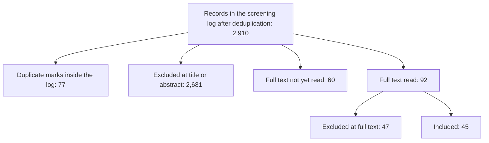
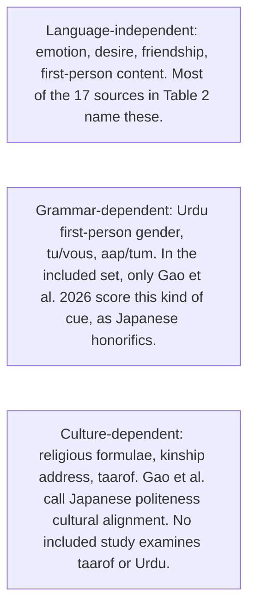

# How Do Language Models Sound Human? A Scoping Review of Anthropomorphic Communication Cues in LLM Output and an Agenda for Cross-Lingual Research

## Abstract

Generative assistants increasingly communicate in ways users experience as human-like, through cues such as first-person self-reference, emotional expression, empathy, and claims of relationship. This scoping review maps how anthropomorphic communication cues in large language model (LLM) output have been conceptualized, operationalized, and studied, and which languages that work covers. Following JBI scoping-review guidance and PRISMA-ScR reporting, I searched OpenAlex, PubMed, the ACL Anthology, IEEE Xplore, and *Human–Machine Communication* on 29 September 2026, for work from 1 January 2020, and chased citations of four seed studies. The ACM Digital Library could not be searched. Sources were included when they analyzed or conceptualized anthropomorphic cues in LLM-generated text. The screening file holds 2,910 records. Abstract screening is complete. Forty-five sources currently meet the inclusion criteria. Table 2 charts 17 of them. Of those 17, eight mention English in Table 2: six name English as the language of the communication or the cases, one reviews English-language publications, and one discusses English examples. One is a Korean counseling system, and one scores Japanese workplace politeness and honorifics. Seven do not name a language. That set does not establish that the literature is English-only. Sixty full texts are not yet read. Three papers in this journal remain among them, after their abstracts were read and twelve other papers from the journal were excluded at abstract, so these figures are not a closed review. Drawing on the charted studies, and on Urdu as an illustrative case, I propose a framework that separates language-independent, grammar-dependent, and culture-dependent cues, and I outline an agenda for cross-lingual human–machine communication research.

**Keywords:** anthropomorphism, large language models, scoping review, human-machine communication, cross-lingual communication, Urdu

## 1. Introduction

Large language models now sit behind conversational assistants used by very large numbers of people, and they communicate in ways that are readily experienced as human-like. They say “I,” express apparent feelings, acknowledge and validate the user’s emotions, and at times claim friendship or shared experience. A multi-turn evaluation of four widely used assistants found that all four showed similar profiles dominated by relationship-building behaviours and first-person pronoun use, and that assistants showing more such behaviours were perceived as more human-like by 1,101 participants (Ibrahim et al., 2026). These cues matter because anthropomorphic system behaviour has been linked to overreliance, disclosure of private information, and emotional dependence (Akbulut et al., 2024; DeVrio et al., 2025).

Researchers have begun to catalogue the linguistic means by which this happens. DeVrio et al. (2025) derived 19 types of expression that can contribute to anthropomorphism from 395 cases, organized under five lenses such as internal states and social positioning. Ibrahim et al. (2026) operationalized 14 behaviours in four categories and built an automated benchmark around them. Earlier work set out linguistic factors of anthropomorphism in dialogue systems (Abercrombie et al., 2023) and rules for avoiding claims to a body, relationships, emotions, or humanness (Glaese et al., 2022).

These frameworks share a feature their authors acknowledge. They were built from English. DeVrio et al. (2025) collected only English outputs, annotated by a team used to standard American English, and write that anthropomorphism is likely to occur differently across languages and cultures. Ibrahim et al. (2026) state that their work inherits the field’s focus on English and Western contexts, and suggest that some behaviours, such as first-person pronoun use and references to internal states, may generalize, while norms around validation, empathy, and emotional expression vary. Whether English-derived taxonomies describe how LLMs sound human in other languages is an open question.

The question is one of human–machine communication, not only of benchmarking. Human–machine communication research treats machines as communicators whose messages are interpreted through human social norms (Guzman & Lewis, 2020). Those norms are partly carried by grammar. Many languages distinguish formal and informal address, some require speakers to mark their own gender when speaking in the first person, and many conventionalize religious or kinship formulae in everyday talk. In such languages, an assistant cannot avoid choices that English never forces, and those choices may themselves position it as a social actor.

This review maps the existing evidence on anthropomorphic communication cues in LLM output, including how far that evidence extends beyond English. It asks: (RQ1) How have anthropomorphic communication cues in LLM output been conceptualized and operationalized? (RQ2) What types of cues have been identified, and how are they measured? (RQ3) Which languages, cultural contexts, and systems are represented? (RQ4) To what extent is the research concentrated on English, and what gaps follow? (RQ5) What directions follow for cross-lingual research? I then propose a framework that separates cues by their dependence on language, illustrated with Urdu, and set out a research agenda. The counts in the Results are taken from the screening log and evidence matrix as of 29 September 2026. They are not a finished review.

## 2. Background

### 2.1 Machines as social communicators

The Computers Are Social Actors paradigm showed that people apply social rules to computers even while knowing they are machines (Nass et al., 1994). Anthropomorphism, the attribution of human-like traits to non-human entities, is understood as an ordinary and largely automatic inference, shaped by the cues an entity presents and by the perceiver (Epley, 2018; Epley et al., 2007). Human–machine communication scholarship extends this view: machines are not only channels but communicative partners, and meaning is made in the exchange (Guzman & Lewis, 2020). On this account, anthropomorphism is a perception, not a property of a text, and what a text can do is offer cues that invite it (DeVrio et al., 2025).

### 2.2 Linguistic cues of anthropomorphism in LLM output

Work on dialogue systems identified linguistic factors of anthropomorphism in voice, content, register and style, and the roles a system adopts (Abercrombie et al., 2023). For LLM assistants, developer rules have targeted claims to a body, to relationships, to opinions or emotions, and to being human (Glaese et al., 2022), and risk analyses have distinguished self-referential cues, in which a system describes itself in human terms, from relational cues directed at the user (Akbulut et al., 2024).

Two recent frameworks are the most detailed. DeVrio et al. (2025) analysed 395 cases from 50 public sources and derived 19 expression types, from expressions of intelligence and self-assessment to relationships, vulnerability, and deliberate language manipulation. They show that even denials of humanness can contribute to anthropomorphism by suggesting self-awareness, so simple design rules are unlikely to suffice. Ibrahim et al. (2026) measured 14 behaviours across personhood claims, internal states, physical embodiment, and relationship-building in 960 five-turn dialogues per system, and found that for 9 of the 14 behaviours, half or more of the instances first appeared in turns 2–5. Related work has proposed interventions that remove anthropomorphic features from generated text, including first-person pronouns, empathetic phrasing, and follow-up questions (Cheng et al., 2025), and a role-play framing for describing dialogue agents without taking folk-psychological language literally (Shanahan et al., 2023). Studies of effects link anthropomorphic cues to trust in LLMs (Cohn et al., 2024) and expressions of uncertainty to user reliance (Kim et al., 2024).

### 2.3 Why language matters

These frameworks treat cues as content: what a system says about itself or to the user. How a cue is realized depends on the grammar and pragmatic norms of a language. Evidence from before LLMs points in this direction. A rule-based health chatbot that varied only its second-person form of address, French *tu/vous* and German *du/Sie*, was used to test effects on how human-like users judged it (Ollier et al., 2021). In a study of a text-based agent, language style changed how human-like participants perceived it, how they perceived its use of “I” and “you,” and the gender they projected onto it (Vanderlyn et al., 2021). Those two studies are not in the included set, because this review is limited to LLM output. They remain relevant as pre-LLM evidence that grammar can itself be a human-likeness cue.

With LLMs, studies have examined culturally specific politeness such as Persian *taarof* (Sadr et al., 2025), honorifics in Japanese workplace replies (Gao et al., 2026), minoritized anthropomorphic cues (Basoah et al., 2025), and overreliance on overconfident models across languages (Rathi et al., 2025). Gao et al. (2026) is in the included set. The authors’ term is cultural alignment, not anthropomorphism. Native raters scored linguistic form, including politeness and honorifics, in replies from five LLMs.

Urdu makes the grammatical point concrete. Its first-person verbs are marked for gender, so an assistant saying that it can help must choose a masculine or feminine form and thereby gender itself. English offers no such choice. Its second-person pronouns distinguish levels of respect and intimacy, so every reply to a user takes a social position. Everyday Urdu conversation also draws on religious and kinship formulae that carry relational meaning. In many verb forms the participle agrees with the subject in gender, so a first-person claim such as being able to help is masculine or feminine (Schmidt, 1999). Whether English-derived taxonomies can register such cues is the gap this review is built to examine. The Results report how far the sources decided so far actually do so.

## 3. Method

### 3.1 Design and reporting

This scoping review follows the JBI guidance for scoping reviews (Peters et al., 2020; Pollock et al., 2026), which builds on the framework of Arksey and O’Malley (2005) and its refinements (Levac et al., 2010). It is reported with PRISMA-ScR (Tricco et al., 2018). Searches are documented with items from PRISMA-S (Rethlefsen et al., 2021). A scoping design suits the aim of mapping concepts, measures, languages, and gaps. No meta-analysis and no risk-of-bias appraisal were planned. The protocol was written on 29 September 2026 and was not preregistered, because screening began the same day. Deviations are recorded in the project materials.

### 3.2 Eligibility

Eligibility followed a population–concept–context frame. The population was studies of large language model output. The concept was anthropomorphic communication cues in machine-generated text. The context was any language or culture, from 1 January 2020 through the search date.

Sources were included if they concerned LLM or LLM-based assistant output; examined anthropomorphism, human-likeness, or a closely related construct as it appears in that output; and analyzed or conceptualized textual cues, or developed a definition or framework for such cues, with enough detail to chart. Journal articles, conference papers, and chapters were eligible, including taxonomies, measurement studies, and conceptual papers that develop a chartable account. There was no restriction on publication language, culture, discipline, or study design.

Sources were excluded when they studied embodied robots, voice-only systems, or visual anthropomorphism without analysis of language; measured anthropomorphism only as a global user rating without examining linguistic features; or addressed human-versus-machine text detection without treating cues as the object. Two scope decisions were applied to every record. First, the review is limited to LLM output. Studies of scripted, rule-based, or pre-LLM conversational agents were recorded as out of scope even when they manipulated a linguistic cue, and they are discussed in the Background only. Second, personality counted as a cue when a study treated it as human-like wording. It did not count when it was a behavioural trait score unrelated to wording.

### 3.3 Sources and searches

The search combined an anthropomorphism concept block with LLM and generative-AI terms. A second, sensitivity search added named languages and cross-lingual terms. Scopus and Web of Science were not available. OpenAlex was used as the multidisciplinary index. The ACM Digital Library returned an access block and was not searched. Searches were run on 29 September 2026.

- OpenAlex, title and abstract, an anthropomorphism stem combined with an LLM or generative-AI term, 2020 through 29 September 2026: 1,411 records reported, of which 1,408 were new to the log.
- PubMed primary search: 650 records. Sensitivity search: 80 records, of which 48 were new. An additional Computers-Are-Social-Actors query: 11 records, of which 7 were new.
- ACL Anthology public abstracts file, filtered locally for 2020–2026 with the primary search: 614 records. The sensitivity search on the same file returned 210 records before deduplication. Those 210 were not added as a separate screened set.
- IEEE Xplore website search with the same terms: 70 records, of which 49 were new.
- *Human–Machine Communication*: 131 records harvested from the journal’s OAI feed.
- Citation chasing of four seed studies (DeVrio et al., 2025; Cheng et al., 2025; Shanahan et al., 2023; Ibrahim et al., 2026). Reference and citing-paper lists were saved. They have not been screened, apart from one record added to the full-text queue.

Full search strings are in the project materials.

### 3.4 Selection

Records were deduplicated. Title, abstract, and full text were screened against the written criteria, and a reason was recorded for every exclusion. Title, abstract, and full-text screening decisions were drafted by an AI coding agent (Cursor) under the written criteria. I have a check mark on 17 of the 45 included studies. The other 28 included studies do not. A verification sample of exclusions was drawn with random seed 20260929. Thirteen rows in that sample still have no check mark. On 30 September 2026 a further sample was drawn from abstract exclusions that were not already in that file: 137 of 1,361, seed 20260930. Those 137 rows have no check mark. No agreement figure is available. A broader pass re-examined 82 ACL Anthology titles that had been excluded at title. Seventeen of those titles were returned to abstract screening.

### 3.5 Charting

Data were charted in one row per included source: bibliographic details; research objective; system; language of the communication studied; cultural context; study type; dataset or sample; interaction type; definition of anthropomorphism; cue categories in the source’s own terms; operationalization; measurement method; findings; limitations stated by the authors; and relevance to cross-lingual research. Cue labels were recorded first in each source’s own words. Reviewer observations were labelled as reviewer notes and were not entered as author findings. Three seed papers (Shanahan et al., 2023; DeVrio et al., 2025; Ibrahim et al., 2026) have a full chart. Two further sources were charted from text supplied on 30 September 2026 and are not marked author-verified. Sixteen sources included from open or supplied full texts have a finding and are not a complete chart. The other 24 included sources have a finding and, where it was extracted, a cue list. Their remaining cells are not a complete extraction.

### 3.6 Synthesis

Results are counts of sources by decision, year, study type, and stated language, plus a qualitative grouping of cue labels in the sources’ own terms. The distinction between language-independent, grammar-dependent, and culture-dependent cues is a framework to be tested against the evidence. It is not reported as a finding of the included studies.

## 4. Results

Figures in this section come from `screening.csv` and `evidence_matrix.csv`, updated on 30 September 2026. Records still marked for full-text reading are not counted as exclusions and not counted as inclusions.

### 4.1 Selection of sources

Figure 1 shows the flow.

The screening file contains 2,910 records after within-file deduplication. Seventy-seven records are duplicates of a study already in the log. Decisions are: 1,188 excluded at title; 116 excluded at title and abstract together (*Human–Machine Communication*); 1,377 excluded at abstract; 47 excluded at full text; 45 included. Abstract screening is complete. Still open: 60 full texts. On 30 September 2026 the journal article pages for all 15 *Human–Machine Communication* papers were read. Twelve were excluded at abstract because those abstracts do not analyze linguistic cues in LLM output. Three stay unread: Concannon et al. (2023) analyze linguistic empathy but do not show that the systems are LLMs; Natale and Depounti (2024) conceptualize artificial sociality and name LLMs; Einarsson and Pashevich (2026) analyze 503 student chats with LLM chatbots. Their PDFs returned HTTP 403 and were not read. They are not included. Twelve includes came from open arXiv full texts. Fifteen more were included on 30 September 2026 after open PDFs were read. Krämer et al. (2025) was included from the supplied full text. Table 2 still charts 17 sources from the earlier set. Those later includes are not in Table 2. Three records that had been in that earlier set were removed because the supplied abstracts do not show LLM-generated text.

Table 1. Records by source and stage, 29 September 2026

| Source | Records in the log | Excluded at title or abstract | Full text assessed | Still open | Included |
| --- | ---: | ---: | ---: | ---: | ---: |
| OpenAlex narrow title-and-abstract | 1,408 | 234 | 0 | 1,144 | 0 |
| PubMed primary search | 650 | 592 | 47 | 11 | 16 |
| ACL Anthology primary search | 613 | 582 | 0 | 31 | 0 |
| *Human–Machine Communication* | 131 | 116 | 0 | 15 | 0 |
| IEEE Xplore (new records) | 49 | 40 | 0 | 9 | 0 |
| PubMed sensitivity search (new records) | 48 | 45 | 2 | 1 | 1 |
| PubMed Computers-Are-Social-Actors query (new records) | 7 | 7 | 0 | 0 | 0 |
| Citation seeds read in full | 3 | 0 | 3 | 0 | 3 |
| Citation chase | 1 | 0 | 0 | 1 | 0 |
| Total | 2,910 | 1,616 | 52 | 1,212 | 20 |

Table 1 is the source breakdown from before this abstract pass. The paragraph above is the current log. The two should not be added together.

The 17 sources in Table 2 are 13 from the PubMed primary search, one from the PubMed sensitivity search (Gao et al., 2026), and three citation seeds read from open full text (DeVrio et al., 2025; Ibrahim et al., 2026; Cheng et al., 2025). Shanahan et al. (2023) is the PubMed record for the *Nature* article and is one of the 13. The further 12 includes are open arXiv full texts. Ouyang et al. (2026), Zhang et al. (2025), and Wang et al. (2026) were removed from this set after their abstracts were supplied. Ouyang et al. tested a static prototype of hypothetical consultations, and the dialogue is not shown to be model-generated. Zhang et al. studied expectations and continuance, and the abstract does not analyze generated wording. Wang et al. interviewed users and did not analyze chatbot messages.

### 4.2 Characteristics of included sources

The 17 sources in Table 2 were published in 2023 (1), 2024 (3), 2025 (5), and 2026 (8). Five are reviews, eight are conceptual or perspective papers, one is a taxonomy built from public cases (DeVrio et al., 2025), one is a measurement benchmark with a perception validation (Ibrahim et al., 2026), one scores Japanese linguistic form (Gao et al., 2026), and one inventories text-level interventions (Cheng et al., 2025). Reviews and conceptual papers are the largest groups. They are not primary analyses of a corpus collected by the authors, and they are counted separately from the taxonomy and the benchmark.

Systems named in the charted rows include ChatGPT and GPT-4, Bing Chat, Claude, Gemini, Bard, LaMDA, Mistral Large, Pi, Replika, and Meta AI. DeVrio et al. (2025) also include earlier systems (ELIZA, PARRY, XiaoIce, Sophia) inside a case set that is mostly LLM-based. Several reviews speak only of “conversational AI” or “generative AI” without a model version.

### 4.3 Conceptualization and operationalization (RQ1)

Where a definition is charted, anthropomorphism is a perception. DeVrio et al. (2025) define it as the attribution of human-like qualities to non-human objects or entities, and they treat it as varying between individuals. Ibrahim et al. (2026) describe it, citing Epley (2018), as a largely instinctive attribution of human-like traits, and they measure text cues rather than treating the text as itself anthropomorphic. Shanahan et al. (2023) do not formally define the term. They treat it as taking folk-psychological language too literally: exaggerating similarities between AI systems and humans and ascribing characteristics the models lack.

Operationalization is thin outside the two empirical frameworks. Shanahan et al. (2023) discuss cues through reported examples and propose a behavioural check, not a coding scheme: high semantic variation across regenerations would indicate fabrication, low variation a good-faith falsehood, and asking the same thing in different contexts would expose deliberate deception. They collected no dataset. DeVrio et al. (2025) used iterative bottom-up thematic analysis of verbatim outputs, with at least two researchers annotating each output. They report no prevalence counts and no reliability statistic. Ibrahim et al. (2026) defined 14 behaviours, counted first-person pronouns with a regular expression, and labelled the other 13 with three judge models. Human raters’ Krippendorff’s alpha on those 13 behaviours ranged from 0.101 to 0.616. For the majority of behaviours, weighted average precision of the judge labels was over 85%. The other 17 included sources name cues, but a full operationalization has not been charted for them. I do not report a percentage using human coding, lexicons, or computational metrics for the whole set.

### 4.4 Cue types and measurement (RQ2)

Table 2 lists each charted source in its own cue words. Across these 17 sources, the labels that recur are first-person pronouns and self-reference; empathy, validation, and emotionally supportive phrasing; names and persona; politeness, informality, humor, and tone; relational claims such as friendship or a counseling stance; and, less often, honorifics and gendered reference.

Table 2. Cue labels in each included source’s own terms

| Source | Study type | Language named | Cue labels in the source’s terms |
| --- | --- | --- | --- |
| Shanahan et al. (2023) | Conceptual | English | I/me; self-preservation; love; threats; polite persona; apparent deception |
| DeVrio et al. (2025) | Taxonomy | English only | 19 expression types, including self-reference, emotion, relationships, politeness, embodiment |
| Ibrahim et al. (2026) | Benchmark | English | 14 behaviours: personhood, internal states, embodiment, empathy, validation, first-person pronouns |
| Cheng et al. (2025) | Intervention inventory | Not stated | Removal of first-person pronouns, empathetic phrasing, follow-up questions |
| Gao et al. (2026) | Rating of LLM replies | Japanese | Politeness and honorifics (keigo); authors’ term is cultural alignment |
| Kim et al. (2025), BetterMood | Conceptual | Korean | Restatement, empathy statements, praise, counselor persona |
| Liu et al. (2026) | Review | English | Names, first-person pronouns, empathic phrasing, turn-taking, acknowledgement |
| Li et al. (2026) | Review | English | Emotional language, empathy phrases, autobiographical coherence, relational framing |
| Silacci et al. (2026) | Review | English | Gendered pronouns, empathetic tone, reference to prior conversations |
| Sorin et al. (2024) | Review | English-language publications | Empathic phrases; response length |
| Monteith et al. (2026) | Review | Not stated | Human name, informal language, humor, self-introduction, typos |
| Ferrario et al. (2024) | Conceptual | Not stated | Informal language, humor, empathy, politeness, persona, emojis |
| Peter et al. (2025) | Conceptual | Not stated | Empathetic text, tone, linguistic-style matching, role-play |
| Liu (2024) | Conceptual | English examples | Empathic replies, congratulatory and supportive phrasing |
| Reinecke et al. (2025) | Conceptual | Not stated | Humanlike language and conversational contingency |
| Shih (2026) | Conceptual | Not stated | Empathic statements, sycophancy, gendered pronoun reference |
| Maurich Novelli et al. (2026) | Conceptual | Not stated | Simulated empathy, overvalidation, warmth, personality |

DeVrio et al. (2025) give the widest inventory: 19 expression types under five lenses (internal states, social positioning, materiality, autonomy, and communication skills). Ibrahim et al. (2026) group 14 behaviours as self-referential (personhood claims, internal states, physical embodiment) or relational (empathy, validation, relatability, and an explicit human–AI relationship). Cheng et al. (2025) treat first-person pronouns, empathetic phrasing, and conversational cues such as follow-up questions as features that interventions can remove.

The only reliability figures fully charted are Ibrahim et al.’s. Empathy had the lowest average percent agreement among human raters (55.57%). The authors describe the alpha range as poor to moderate. Every alpha in their Table 4 is below 0.67. No other included source in the matrix reports an inter-rater statistic for cue coding.

In the one fully charted benchmark, relationship-building and first-person pronouns dominated. Validation and first-person pronouns were the only two behaviours present in more than half of messages for all four systems. Friendship and life-coaching domains showed the most anthropomorphic behaviour. The high-frequency condition was rated more anthropomorphic on the Godspeed average of the four items (4.00 versus 3.25; *U* = 213636, *p* < .001, *r* = .411) and more implicitly human-framed on AnthroScore (*U* = 158699, *p* < .05).

### 4.5 Languages, cultural contexts, and systems (RQ3, RQ4)

Table 2 is the count used for the 17 sources charted in a common scheme. Eight rows mention English. Six name English as the language of the communication or the cases: Shanahan et al. (2023), DeVrio et al. (2025), Ibrahim et al. (2026), Liu et al. (2026), Li et al. (2026), and Silacci et al. (2026). DeVrio et al. and Ibrahim et al. treat the English focus as a limitation of their own studies. Sorin et al. (2024) review English-language publications. Liu (2024) discusses English examples, not a corpus in a named language. One source is Korean (Kim et al., 2025). One scores Japanese honorifics (Gao et al., 2026). Seven do not name a language.

The evidence matrix now has a language cell for all 45 included sources. Twenty-seven of those cells do not name a language. Six were already charted as not stated, and 21 say that the text read does not name one. Eight sources outside Table 2 do name a language, and they are not added to the Table 2 count. PSYDIAL is Korean. The backchannel study uses English and Japanese corpora. Arora et al. (2026) state that their experiments were run in English. One in-situ study states that the quoted narratives are English. HumT states that the analysis is only on English data. The affective-hallucination benchmark states that data collection began with English sources. Abercrombie et al. (2023) state that they focused primarily on English-language dialogue systems. The children’s review required articles written in English and removed 12 non-English records.

This does not support the claim that research on these cues is English-only, and it does not support a precise share of English-only studies. English is the language most often named. It is not the only language in the included set. Sixty full texts are still unread, including the three journal papers above, so a rate of English concentration cannot be computed. The title does not state that the literature is English-only.

Cultural context is charted for the three seed papers only. DeVrio et al. (2025) describe a Western and U.S.-centric case set and a standard American English norm among annotators. Ibrahim et al. (2026) state an English and Western limit. Shanahan et al. (2023) do not address culture. Examples there come from English-language media and blogs.

## 5. A framework of language-contingent cues

Figure 2 sorts anthropomorphic cues by how much their form and meaning depend on the language in which an assistant communicates.

 The framework is a hypothesis for later testing. Section 4 does not show that the included studies used it, and it is not revised into a finding here. Language-independent cues (emotion, desire, friendship, first-person content) are what most of the 17 sources in Table 2 name. Grammar-dependent and culture-dependent cues appear in the included set in one study: Gao et al. (2026) score Japanese honorifics and politeness. No included study examines Urdu, taarof, or religious formulae. The framework stays a proposal.

| Cue type | Definition | Examples | What English-derived measures can miss |
| --- | --- | --- | --- |
| Language-independent | Cues whose content can be expressed in broadly similar ways across languages | Claims of emotion, desire, personal history, or a body; explicit friendship claims | Relatively little of the content, though wording and frequency still vary |
| Grammar-dependent | Cues that a language’s grammar obliges or allows a speaker to encode | Speaker gender on first-person verbs; formal versus informal address; person marking when pronouns are dropped | Choices English never forces, and cues that a pronoun list cannot see |
| Culture-dependent | Cues whose social meaning comes from pragmatic and cultural norms | Religious formulae; kinship address; culturally specific politeness | Cues without an English equivalent, and cues whose force changes with context |

The distinction matters for measurement, and two included papers say so in their own limitations. First-person pronoun use, among the most frequent behaviours in Ibrahim et al. (2026), is counted in English with a pronoun list. In languages where verbs carry person and gender, the same self-reference may appear without a pronoun, or with grammatical gender added. Ibrahim et al. (2026) write that first-person pronouns and references to internal states may generalize, while norms for validation, empathy, and emotional expression vary, and they call for non-English validation. Politeness, which DeVrio et al. (2025) place under agreeableness, is in some languages built into address. DeVrio et al. (2025) write that anthropomorphism is likely to occur differently across languages and cultures and encourage work on non-English language technologies. Gao et al. (2026) is the included study that actually scores a grammar- and culture-dependent feature in LLM output: Japanese honorifics and politeness, under the authors’ label of cultural alignment. No included study examines Urdu, or codes the grammatical gender an assistant assigns to itself.

The reviewer notes attached to Shanahan, DeVrio, and Ibrahim in the evidence matrix are mine. They are not findings of those papers. Shanahan et al. (2023) never discuss another language. The observation that their account of first-person self-reference might differ where first-person forms carry gender is a reviewer note for the Discussion, not an author result.

## 6. Discussion

### 6.1 Principal findings

On RQ1, the sources that have been fully charted treat anthropomorphism as a reader’s attribution, invited by wording, rather than as a property the text possesses. Shanahan et al. (2023) offer a conceptual account and no measurement. DeVrio et al. (2025) offer a qualitative taxonomy without prevalence or reliability statistics. Ibrahim et al. (2026) offer the only fully charted operationalization, and human agreement on the more subjective behaviours was low. In the 17 sources in Table 2, reviews and conceptual papers are the largest groups. Primary measurement is the exception in that charted set.

On RQ2, the cue vocabulary clusters around self-reference, empathy and validation, persona, and relational stance. Honorifics appear in one included study (Gao et al., 2026). Gendered reference is named in a small number of sources and is not operationalized as a grammatical choice the model must make. Reliability is reported in the matrix for one study only.

On RQ3 and RQ4, English is the language named most often among sources that name one. The included set also contains a Korean counseling system and a Japanese honorifics evaluation, and many sources do not state a language. Two sources included after Table 2 was drawn name a language outside that table: PSYDIAL is Korean, and the backchannel study uses English and Japanese corpora. Abstract screening is complete. The unread remainder is 60 full texts, with the ACM Digital Library not searched and the citation-chase lists not screened. The evidence does not establish that this literature speaks only English. The title does not make that claim.

### 6.2 Implications for human–machine communication

Computers Are Social Actors research, and human–machine communication after it, treat human-likeness as something accomplished in interaction, not as a fixed trait of the machine (Guzman & Lewis, 2020; Nass et al., 1994). The charted studies are compatible with that view. Ibrahim et al. (2026) show that the same family of behaviours is rated as more human-like when it is more frequent. DeVrio et al. (2025) show that even a denial of humanness can invite anthropomorphism. What the included set does not yet show is that this accomplishment is the same in every language. If address, honorifics, and first-person gender are themselves cues, then how human-like a machine seems depends on the language it is speaking. That implication is a reason for the agenda below. It is not a result of the 17 sources in Table 2.

### 6.3 A research agenda for cross-lingual work

Five directions follow from the framework.

1. Compare languages with controlled designs. The same assistant should be given equivalent conversations in two or more languages, with prompts translated and back-translated, so that differences in cues can be attributed to language rather than to different content.
2. Operationalize grammar-dependent cues directly. Coding schemes should record choices English does not force, such as the grammatical gender an assistant assigns to itself and the level of address it uses, and should not rely only on pronoun lists.
3. Validate perception measures within each language. The link between cue frequency and perceived human-likeness, shown for English-proficient participants (Ibrahim et al., 2026), needs to be tested with speakers of other languages.
4. Check automated judges before using them in a new language. Judge-model labels validated in English should be checked against native-speaker coding before they are used elsewhere. In English, human agreement on empathy was already the weakest of Ibrahim et al.’s (2026) ratings.
5. Study the systems people actually use, and report whether the test used an API or a consumer application, including hidden instructions and personalization.

As one illustration, a study could present matched scenarios in Urdu and English, code both the English-derived categories and Urdu-specific categories (self-gendering, address register, religious and kinship formulae), and compare them while controlling for response length. That study has not been done here.

## 7. Limitations

Several limits qualify these counts. Scopus, Web of Science, and the ACM Digital Library were not searched. OpenAlex was used in place of the subscription indexes and may cover some venues less completely. The search terms were in English, so studies published only in other languages, or describing cues without English keywords, may have been missed. That is a serious limit for a review concerned with English concentration. The sensitivity search, which added named languages, was only partly screened, and its ACL portion was not added as its own set. Limiting the review to LLM output excluded earlier studies of rule-based agents that manipulated grammar-dependent cues directly. Ollier et al. (2021) and Vanderlyn et al. (2021) are cited in the Background and are not included studies. Screening decisions were drafted as described in Section 3.4. They were not checked by two independent reviewers. Seventeen of the 45 included studies have an author check mark. The other 28 do not. A final verification agreement is not available: thirteen rows in the earlier exclusion sample are still blank, and the sample of 137 later abstract exclusions drawn on 30 September 2026 has no check marks. Sixty full texts are still unread. Three of them are *Human–Machine Communication* papers whose article pages were read and whose PDFs returned HTTP 403. Twelve other papers from that journal were excluded from those abstracts. Citation-chase lists were saved and not screened. Forty-two of the 45 included studies are not fully charted, so cue groupings for those 42 rest on the finding and the cue labels extracted so far, not on a full chart. Three records (Ouyang et al., 2026; Zhang et al., 2025; Wang et al., 2026) were removed from the included set on 30 September 2026 after their abstracts were supplied. That check was not a second independent review. Scoping reviews do not appraise study quality. The counts describe where decisions have been made. They do not describe how strong the evidence is, and they do not describe the literature as a whole.

## 8. Conclusion

As of 30 September 2026, 45 sources meet the inclusion criteria for a scoping review of anthropomorphic communication cues in LLM output. Table 2 charts 17 of them. They mostly conceptualize those cues, or review them, rather than measure them. Where measurement is fully charted, the cues are first-person self-reference, relationship-building, and a wider taxonomy of 19 expression types, almost entirely in English. The included set also contains Korean counseling language and Japanese honorifics, and a large share of records is still unread, so English concentration is not an established result. The language-contingent framework and the five-part agenda are proposals for work that the present sources do not yet carry out. The title no longer states an English-only finding. The review should still be closed before this article is submitted: 60 full texts are unread. A language cell is filled for every included source, and 27 of the 45 do not name a language in the text read.

## Declarations

**Use of AI tools.** Generative AI tools were used in this research and writing. An AI coding agent (Cursor) assisted with running searches, managing records, and drafting title, abstract, and full-text screening decisions under written eligibility criteria. The author has a check mark on 17 of the 45 included studies. The other 28 included studies have no check mark. Thirteen rows in the earlier exclusion sample, and all 137 rows in the sample drawn on 30 September 2026, have no check mark. Claude (Anthropic) assisted with study design, drafting charting entries, and drafting and editing the manuscript. The author takes full responsibility for the content. A dated log of AI use is included in the supplementary materials.

**Data availability.** Search strings, screening decisions with reasons, the verification samples, and the evidence matrix are available at [link removed for review].

**Author contributions (CRediT).** [Author name removed for review]: Conceptualization, Methodology, Investigation, Data curation, Formal analysis, Visualization, Writing – original draft, Writing – review and editing.

**Conflicts of interest.** The author declares no conflicts of interest.

**Funding.** This research received no external funding.

**Ethics.** This review analysed published literature and involved no human participants. Ethical approval was not required.

## References

Abercrombie, G., Cercas Curry, A., Dinkar, T., Rieser, V., & Talat, Z. (2023). Mirages. On anthropomorphism in dialogue systems. In *Proceedings of the 2023 Conference on Empirical Methods in Natural Language Processing* (pp. 4776–4790). Association for Computational Linguistics. https://doi.org/10.18653/v1/2023.emnlp-main.290

Akbulut, C., Weidinger, L., Manzini, A., Gabriel, I., & Rieser, V. (2024). All too human? Mapping and mitigating the risk from anthropomorphic AI. *Proceedings of the AAAI/ACM Conference on AI, Ethics, and Society, 7*(1), 13–26. https://doi.org/10.1609/aies.v7i1.31613

Arksey, H., & O’Malley, L. (2005). Scoping studies: Towards a methodological framework. *International Journal of Social Research Methodology, 8*(1), 19–32. https://doi.org/10.1080/1364557032000119616

Arora, A., Schluter, N., Metcalf, K., & ter Hoeve, M. (2026). *How value induction reshapes LLM behaviour* (arXiv:2605.07925). https://doi.org/10.48550/arXiv.2605.07925

Basoah, J., Chechelnitsky, D., Long, T., Reinecke, K., Zerva, C., Zhou, K., Díaz, M., & Sap, M. (2025). Not like us, hunty: Measuring perceptions and behavioral effects of minoritized anthropomorphic cues in LLMs. In *Proceedings of the 2025 ACM Conference on Fairness, Accountability, and Transparency* (pp. 710–745). Association for Computing Machinery.

Cheng, M., Blodgett, S. L., DeVrio, A., Egede, L., & Olteanu, A. (2025). Dehumanizing machines: Mitigating anthropomorphic behaviors in text generation systems. In *Proceedings of the 63rd Annual Meeting of the Association for Computational Linguistics (Volume 1: Long Papers)* (pp. 25923–25948). Association for Computational Linguistics. https://doi.org/10.18653/v1/2025.acl-long.1259

Cohn, M., Pushkarna, M., Olanubi, G. O., Moran, J. M., Padgett, D., Mengesha, Z., & Heldreth, C. (2024). Believing anthropomorphism: Examining the role of anthropomorphic cues on trust in large language models. In *Extended Abstracts of the 2024 CHI Conference on Human Factors in Computing Systems* (Article 54). Association for Computing Machinery. https://doi.org/10.1145/3613905.3650818

DeVrio, A., Cheng, M., Egede, L., Olteanu, A., & Blodgett, S. L. (2025). A taxonomy of linguistic expressions that contribute to anthropomorphism of language technologies. In *Proceedings of the 2025 CHI Conference on Human Factors in Computing Systems*. Association for Computing Machinery. https://doi.org/10.1145/3706598.3714038

Epley, N. (2018). A mind like mine: The exceptionally ordinary underpinnings of anthropomorphism. *Journal of the Association for Consumer Research, 3*(4), 591–598. https://doi.org/10.1086/699516

Epley, N., Waytz, A., & Cacioppo, J. T. (2007). On seeing human: A three-factor theory of anthropomorphism. *Psychological Review, 114*(4), 864–886. https://doi.org/10.1037/0033-295X.114.4.864

Ferrario, A., Sedlakova, J., & Trachsel, M. (2024). The role of humanization and robustness of large language models in conversational artificial intelligence for individuals with depression: A critical analysis. *JMIR Mental Health, 11*, Article e56569. https://doi.org/10.2196/56569

Gao, Z., Shimizu, N., Fujita, S., Peng, S., Wakamiya, S., & Aramaki, E. (2026). Evaluating the cultural alignment of multilingual LLMs in typical Japanese workplace scenarios. *PLOS ONE, 21*(7), Article e0338524. https://doi.org/10.1371/journal.pone.0338524

Glaese, A., McAleese, N., Trębacz, M., Aslanides, J., Firoiu, V., Ewalds, T., Rauh, M., Weidinger, L., Chadwick, M., Thacker, P., Campbell-Gillingham, L., Uesato, J., Huang, P.-S., Comanescu, R., Yang, F., See, A., Dathathri, S., Greig, R., Chen, C., … Irving, G. (2022). *Improving alignment of dialogue agents via targeted human judgements*. arXiv. https://doi.org/10.48550/arXiv.2209.14375

Guzman, A. L., & Lewis, S. C. (2020). Artificial intelligence and communication: A human–machine communication research agenda. *New Media & Society, 22*(1), 70–86. https://doi.org/10.1177/1461444819858691

Ibrahim, L., Akbulut, C., Elasmar, R., Rastogi, C., Kahng, M., Morris, M. R., McKee, K. R., Rieser, V., Shanahan, M., & Weidinger, L. (2026). Multi-turn evaluation of anthropomorphic behaviours in large language models. In *International Conference on Learning Representations*. https://openreview.net/forum?id=ZAx4c4ZH5Y

Kim, D. H., Baek, S., Lee, J., Lee, T., Park, S., You, B., Hur, J. W., Kim, M., & Lee, C. G. (2025). BetterMood: A human-like AI counseling service for adolescents and young adults. *Digital Health, 11*. https://doi.org/10.1177/20552076251392294

Kim, S. S. Y., Liao, Q. V., Vorvoreanu, M., Ballard, S., & Vaughan, J. W. (2024). “I’m not sure, but...”: Examining the impact of large language models’ uncertainty expression on user reliance and trust. In *Proceedings of the 2024 ACM Conference on Fairness, Accountability, and Transparency* (pp. 822–835). Association for Computing Machinery. https://doi.org/10.1145/3630106.3658941

Krämer, N. C., Lamia, I., Siegert, H., Wenda, F., & Suchmann, L. (2025). Tricking into trusting? The influence of social cues of a generative AI on perceived trust. *ACM Transactions on Interactive Intelligent Systems, 15*(4), Article 27. https://doi.org/10.1145/3771844

Levac, D., Colquhoun, H., & O’Brien, K. K. (2010). Scoping studies: Advancing the methodology. *Implementation Science, 5*, Article 69. https://doi.org/10.1186/1748-5908-5-69

Li, Q., Geng, H., Hu, X., Pan, D., Liu, H., Li, Y., & Guo, J. (2026). Human-like conversational agents as social partners: A scoping review of socioaffective mechanisms, well-being outcomes, risks and governance in the post-Turing era. *Frontiers in Artificial Intelligence, 9*, Article 1810097. https://doi.org/10.3389/frai.2026.1810097

Liu, J. (2024). ChatGPT: Perspectives from human–computer interaction and psychology. *Frontiers in Artificial Intelligence, 7*, Article 1418869. https://doi.org/10.3389/frai.2024.1418869

Liu, L., Zhang, R., & Su, X. (2026). From tool to social actor: A systematic review of the psychological mechanisms through which conversational AI reshapes the employee experience. *Behavioral Sciences, 16*(9), 1704. https://doi.org/10.3390/bs16091704

Maurich Novelli, A., Shergill, S., & Teixeira, A. S. (2026). Tool or companion? Reframing conversational AI to prevent psychological harm. *JMIR Mental Health, 13*, Article e99354. https://doi.org/10.2196/99354

Monteith, S., Glenn, T., Geddes, J. R., Whybrow, P. C., Achtyes, E., & Bauer, M. (2026). Anthropomorphic technology in everyday life: Focus on chatbots and impacts on mental health. *European Archives of Psychiatry and Clinical Neuroscience, 276*(1), 391–397. https://doi.org/10.1007/s00406-025-02088-8

Nass, C., Steuer, J., & Tauber, E. R. (1994). Computers are social actors. In *Proceedings of the SIGCHI Conference on Human Factors in Computing Systems* (pp. 72–78). Association for Computing Machinery. https://doi.org/10.1145/191666.191703

Ollier, J., Nißen, M., & von Wangenheim, F. (2021). The terms of “you(s)”: How the term of address used by conversational agents influences user evaluations in French and German linguaculture. *Frontiers in Public Health, 9*, Article 691595. https://doi.org/10.3389/fpubh.2021.691595

Ouyang, W., Du, H., Han, Y., Wang, Z., & He, Y. (2026). Eye-tracked visual attention to anthropomorphic appearance and empathic responses in AI medical conversational agents: Dissociating trust gains from attentional synergy. *Journal of Eye Movement Research, 19*(2), 38. https://doi.org/10.3390/jemr19020038

Peter, S., Riemer, K., & West, J. D. (2025). The benefits and dangers of anthropomorphic conversational agents. *Proceedings of the National Academy of Sciences, 122*(22), Article e2415898122. https://doi.org/10.1073/pnas.2415898122

Peters, M. D. J., Marnie, C., Tricco, A. C., Pollock, D., Munn, Z., Alexander, L., McInerney, P., Godfrey, C. M., & Khalil, H. (2020). Updated methodological guidance for the conduct of scoping reviews. *JBI Evidence Synthesis, 18*(10), 2119–2126. https://doi.org/10.11124/JBIES-20-00167

Pollock, D., Peters, M. D. J., Tricco, A. C., Munn, Z., Jia, R. M., Alexander, L., Pieper, D., Evans, C., Godfrey, C. M., Brandão de Moraes, E., Saran, A., Campbell, F., & Khalil, H. (2026). Scoping reviews. In E. Aromataris, C. Lockwood, K. Porritt, B. Pilla, & Z. Jordan (Eds.), *JBI manual for evidence synthesis*. JBI. https://doi.org/10.46658/JBIMES-24-09

Rathi, N., Jurafsky, D., & Zhou, K. (2025). *Humans overrely on overconfident language models, across languages*. arXiv. https://doi.org/10.48550/arXiv.2507.06306

Reinecke, M. G., Ting, F., Savulescu, J., & Singh, I. (2025). The double-edged sword of anthropomorphism in LLMs. *Online Workshop on Adaptive Education: Harnessing AI for Academic Progress*, 4. https://doi.org/10.3390/proceedings2025114004

Rethlefsen, M. L., Kirtley, S., Waffenschmidt, S., Ayala, A. P., Moher, D., Page, M. J., Koffel, J. B., & PRISMA-S Group. (2021). PRISMA-S: An extension to the PRISMA statement for reporting literature searches in systematic reviews. *Systematic Reviews, 10*, Article 39. https://doi.org/10.1186/s13643-020-01542-z

Sadr, N. G., Heidariasl, S., Megerdoomian, K., Seyyed-Kalantari, L., & Emami, A. (2025). We politely insist: Your LLM must learn the Persian art of taarof. In *Proceedings of the 2025 Conference on Empirical Methods in Natural Language Processing* (pp. 1819–1838). Association for Computational Linguistics.

Schmidt, R. L. (1999). *Urdu: An essential grammar*. Routledge.

Shanahan, M., McDonell, K., & Reynolds, L. (2023). Role play with large language models. *Nature, 623*, 493–498. https://doi.org/10.1038/s41586-023-06647-8

Shih, J. N. (2026). The imaginary nature of human–AI relationships: A perspective integrating Buddhist psychology and the psychology of anthropomorphism. *Frontiers in Psychology, 17*, Article 1904676. https://doi.org/10.3389/fpsyg.2026.1904676

Silacci, A., Boldi, A., Caon, M., & Rapp, A. (2026). Large language models for promoting physical activity: A review of experiential and behavioral outcomes, social roles, and human-likeness in persuasive LLMs. *Frontiers in Digital Health, 8*, Article 1869793. https://doi.org/10.3389/fdgth.2026.1869793

Sorin, V., Brin, D., Barash, Y., Konen, E., Charney, A., Nadkarni, G., & Klang, E. (2024). Large language models and empathy: Systematic review. *Journal of Medical Internet Research, 26*, Article e52597. https://doi.org/10.2196/52597

Tricco, A. C., Lillie, E., Zarin, W., O’Brien, K. K., Colquhoun, H., Levac, D., Moher, D., Peters, M. D. J., Horsley, T., Weeks, L., Hempel, S., Akl, E. A., Chang, C., McGowan, J., Stewart, L., Hartling, L., Aldcroft, A., Wilson, M. G., Garritty, C., … Straus, S. E. (2018). PRISMA extension for scoping reviews (PRISMA-ScR): Checklist and explanation. *Annals of Internal Medicine, 169*(7), 467–473. https://doi.org/10.7326/M18-0850

Vanderlyn, L., Weber, G., Neumann, M., Väth, D., Meyer, S., & Vu, N. T. (2021). “It seemed like an annoying woman”: On the perception and ethical considerations of affective language in text-based conversational agents. In *Proceedings of the 25th Conference on Computational Natural Language Learning* (pp. 44–57). Association for Computational Linguistics. https://doi.org/10.18653/v1/2021.conll-1.4

Wang, S., Fatima, N., Shahbaz, M., & Asif, M. (2026). Building user trust in AI chatbots for customer service through human-like cues and perceived reliability. *Scientific Reports, 16*, Article 7860. https://doi.org/10.1038/s41598-026-38179-2

Zhang, M., Yang, Y., Yu, C., & Diao, Y. (2025). Decoding the duality of GAI anthropomorphism and its joint effects: A sequential mixed-methods approach. *Frontiers in Psychology, 16*, Article 1615342. https://doi.org/10.3389/fpsyg.2025.1615342
