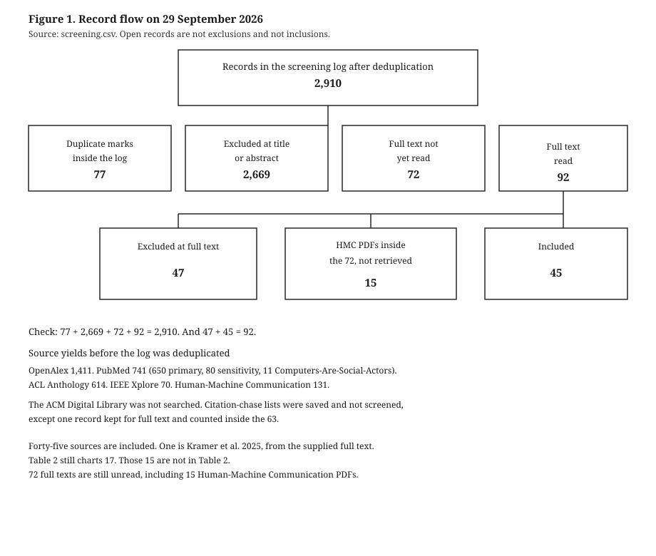
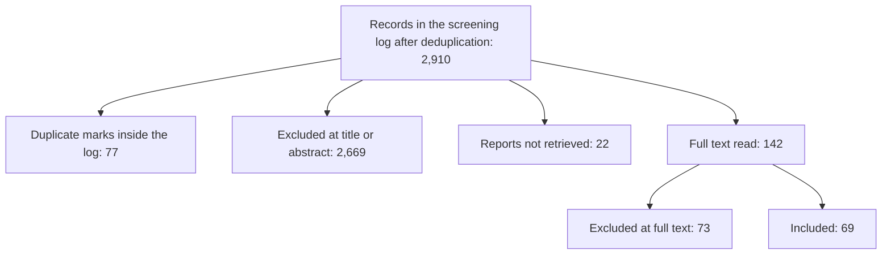
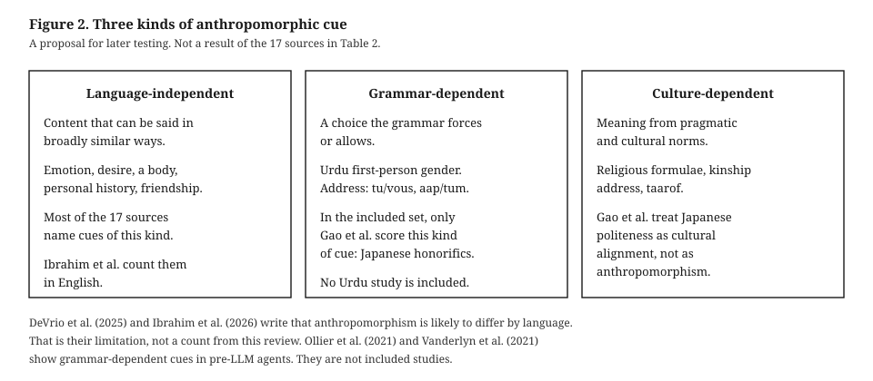
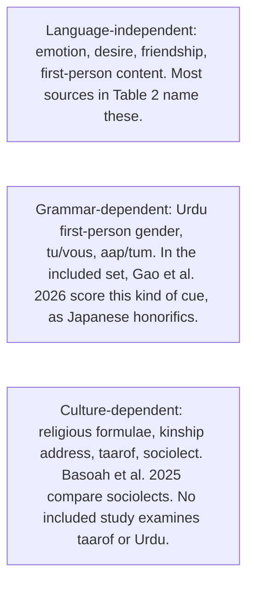

# How Do Language Models Sound Human? A Scoping Review of Anthropomorphic Communication Cues in LLM Output and an Agenda for Cross-Lingual Research

## Abstract

Generative assistants increasingly communicate in ways users experience as human-like, through cues such as first-person self-reference, emotional expression, empathy, and claims of relationship. This scoping review maps how anthropomorphic communication cues in large language model (LLM) output have been conceptualized, operationalized, and studied, and which languages that work covers. Following JBI scoping-review guidance and PRISMA-ScR reporting, I searched OpenAlex, PubMed, the ACL Anthology, IEEE Xplore, and *Human–Machine Communication* on 29 September 2026, for work from 1 January 2020, and chased citations of four seed studies. The ACM Digital Library could not be searched. Sources were included when they analyzed or conceptualized anthropomorphic cues in LLM-generated text. The screening file holds 2,910 records. Abstract and full-text screening are complete for every report that could be obtained. Sixty-nine sources meet the inclusion criteria. Twenty-two reports were not retrieved. Table 2 charts all 69, with study type, system, the language the authors state, the language evident from examples, prompts, or datasets, and cue labels. Twenty-three sources state a language. Fourteen more do not state one, but the examples, prompts, or dataset excerpts in the text read are English. Where a language is evident, 27 sources are English. The set also includes Korean, Japanese, Chinese, Dutch, African American English, and Queer slang. Thirty-two sources have no language in either column. That does not establish that the literature is English-only. Drawing on the charted studies, and on Urdu as an illustrative case, I propose a framework that separates language-independent, grammar-dependent, and culture-dependent cues, and I outline an agenda for cross-lingual human–machine communication research.

**Keywords:** anthropomorphism, large language models, scoping review, human-machine communication, cross-lingual communication, Urdu

## 1. Introduction

Large language models now sit behind conversational assistants used by very large numbers of people, and they communicate in ways that are readily experienced as human-like. They say “I,” express apparent feelings, acknowledge and validate the user’s emotions, and at times claim friendship or shared experience. A multi-turn evaluation of four widely used assistants found that all four showed similar profiles dominated by relationship-building behaviours and first-person pronoun use, and that assistants showing more such behaviours were perceived as more human-like by 1,101 participants (Ibrahim et al., 2026). These cues matter because anthropomorphic system behaviour has been linked to overreliance, disclosure of private information, and emotional dependence (Akbulut et al., 2024; DeVrio et al., 2025).

Researchers have begun to catalogue the linguistic means by which this happens. DeVrio et al. (2025) derived 19 types of expression that can contribute to anthropomorphism from 395 cases, organized under five lenses such as internal states and social positioning. Ibrahim et al. (2026) operationalized 14 behaviours in four categories and built an automated benchmark around them. Earlier work set out linguistic factors of anthropomorphism in dialogue systems (Abercrombie et al., 2023) and rules for avoiding claims to a body, relationships, emotions, or humanness (Glaese et al., 2022).

These frameworks share a feature their authors acknowledge. They were built from English. DeVrio et al. (2025) collected only English outputs, annotated by a team used to standard American English, and write that anthropomorphism is likely to occur differently across languages and cultures. Ibrahim et al. (2026) state that their work inherits the field’s focus on English and Western contexts, and suggest that some behaviours, such as first-person pronoun use and references to internal states, may generalize, while norms around validation, empathy, and emotional expression vary. Whether English-derived taxonomies describe how LLMs sound human in other languages is an open question.

The question is one of human–machine communication, not only of benchmarking. Human–machine communication research treats machines as communicators whose messages are interpreted through human social norms (Guzman & Lewis, 2020). Those norms are partly carried by grammar. Many languages distinguish formal and informal address, some require speakers to mark their own gender when speaking in the first person, and many conventionalize religious or kinship formulae in everyday talk. In such languages, an assistant cannot avoid choices that English never forces, and those choices may themselves position it as a social actor.

This review maps the existing evidence on anthropomorphic communication cues in LLM output, including how far that evidence extends beyond English. It asks: (RQ1) How have anthropomorphic communication cues in LLM output been conceptualized and operationalized? (RQ2) What types of cues have been identified, and how are they measured? (RQ3) Which languages, cultural contexts, and systems are represented? (RQ4) To what extent is the research concentrated on English, and what gaps follow? (RQ5) What directions follow for cross-lingual research? I then propose a framework that separates cues by their dependence on language, illustrated with Urdu, and set out a research agenda. The counts in the Results are taken from the screening log and evidence matrix as of 30 September 2026.

## 2. Background

### 2.1 Machines as social communicators

The Computers Are Social Actors paradigm showed that people apply social rules to computers even while knowing they are machines (Nass et al., 1994). Anthropomorphism, the attribution of human-like traits to non-human entities, is understood as an ordinary and largely automatic inference, shaped by the cues an entity presents and by the perceiver (Epley, 2018; Epley et al., 2007). Human–machine communication scholarship extends this view: machines are not only channels but communicative partners, and meaning is made in the exchange (Guzman & Lewis, 2020). On this account, anthropomorphism is a perception, not a property of a text, and what a text can do is offer cues that invite it (DeVrio et al., 2025).

### 2.2 Linguistic cues of anthropomorphism in LLM output

Work on dialogue systems identified linguistic factors of anthropomorphism in voice, content, register and style, and the roles a system adopts (Abercrombie et al., 2023). For LLM assistants, developer rules have targeted claims to a body, to relationships, to opinions or emotions, and to being human (Glaese et al., 2022), and risk analyses have distinguished self-referential cues, in which a system describes itself in human terms, from relational cues directed at the user (Akbulut et al., 2024).

Two recent frameworks are the most detailed. DeVrio et al. (2025) analysed 395 cases from 50 public sources and derived 19 expression types, from expressions of intelligence and self-assessment to relationships, vulnerability, and deliberate language manipulation. They show that even denials of humanness can contribute to anthropomorphism by suggesting self-awareness, so simple design rules are unlikely to suffice. Ibrahim et al. (2026) measured 14 behaviours across personhood claims, internal states, physical embodiment, and relationship-building in 960 five-turn dialogues per system, and found that for 9 of the 14 behaviours, half or more of the instances first appeared in turns 2–5. Related work has proposed interventions that remove anthropomorphic features from generated text, including first-person pronouns, empathetic phrasing, and follow-up questions (Cheng, Blodgett, et al., 2025), and a role-play framing for describing dialogue agents without taking folk-psychological language literally (Shanahan et al., 2023). Studies of effects link anthropomorphic cues to trust in LLMs (Cohn et al., 2024) and expressions of uncertainty to user reliance (Kim et al., 2024).

### 2.3 Why language matters

These frameworks treat cues as content: what a system says about itself or to the user. How a cue is realized depends on the grammar and pragmatic norms of a language. Evidence from before LLMs points in this direction. A rule-based health chatbot that varied only its second-person form of address, French *tu/vous* and German *du/Sie*, was used to test effects on how human-like users judged it (Ollier et al., 2021). In a study of a text-based agent, language style changed how human-like participants perceived it, how they perceived its use of “I” and “you,” and the gender they projected onto it (Vanderlyn et al., 2021). Those two studies are not in the included set, because this review is limited to LLM output. They remain relevant as pre-LLM evidence that grammar can itself be a human-likeness cue.

With LLMs, studies have examined culturally specific politeness such as Persian *taarof* (Sadr et al., 2025), honorifics in Japanese workplace replies (Gao et al., 2026), minoritized anthropomorphic cues (Basoah et al., 2025), and overreliance on overconfident models across languages (Rathi et al., 2025). Gao et al. (2026) is in the included set. The authors’ term is cultural alignment, not anthropomorphism. Native raters scored linguistic form, including politeness and honorifics, in replies from five LLMs.

Urdu makes the grammatical point concrete. Its first-person verbs are marked for gender, so an assistant saying that it can help must choose a masculine or feminine form and thereby gender itself. English offers no such choice. Its second-person pronouns distinguish levels of respect and intimacy, so every reply to a user takes a social position. Everyday Urdu conversation also draws on religious and kinship formulae that carry relational meaning. In many verb forms the participle agrees with the subject in gender, so a first-person claim such as being able to help is masculine or feminine (Schmidt, 1999). Whether English-derived taxonomies can register such cues is the gap this review is built to examine. The Results report how far the sources decided so far actually do so.

## 3. Method

### 3.1 Design and reporting

This scoping review follows the JBI guidance for scoping reviews (Peters et al., 2020; Pollock et al., 2026), which builds on the framework of Arksey and O’Malley (2005) and its refinements (Levac et al., 2010). It is reported with PRISMA-ScR (Tricco et al., 2018). Searches are documented with items from PRISMA-S (Rethlefsen et al., 2021). A scoping design suits the aim of mapping concepts, measures, languages, and gaps. No meta-analysis and no risk-of-bias appraisal were planned. The protocol was written on 29 September 2026 and was not preregistered, because screening began the same day. Deviations are recorded in the project materials.

### 3.2 Eligibility

Eligibility followed a population–concept–context frame. The population was studies of large language model output. The concept was anthropomorphic communication cues in machine-generated text. The context was any language or culture, from 1 January 2020 through the search date.

Sources were included if they concerned LLM or LLM-based assistant output; examined anthropomorphism, human-likeness, or a closely related construct as it appears in that output; and analyzed or conceptualized textual cues, or developed a definition or framework for such cues, with enough detail to chart. Journal articles, conference papers, and chapters were eligible, including taxonomies, measurement studies, and conceptual papers that develop a chartable account. There was no restriction on publication language, culture, discipline, or study design.

Sources were excluded when they studied embodied robots, voice-only systems, or visual anthropomorphism without analysis of language; measured anthropomorphism only as a global user rating without examining linguistic features; or addressed human-versus-machine text detection without treating cues as the object. Two scope decisions were applied to every record. First, the review is limited to LLM output. Studies of scripted, rule-based, or pre-LLM conversational agents were recorded as out of scope even when they manipulated a linguistic cue, and they are discussed in the Background only. Second, personality counted as a cue when a study treated it as human-like wording. It did not count when it was a behavioural trait score unrelated to wording.

### 3.3 Sources and searches

The search combined an anthropomorphism concept block with LLM and generative-AI terms. A second, sensitivity search added named languages and cross-lingual terms. Scopus and Web of Science were not available. OpenAlex was used as the multidisciplinary index. The ACM Digital Library returned an access block and was not searched. Searches were run on 29 September 2026.

- OpenAlex, title and abstract, an anthropomorphism stem combined with an LLM or generative-AI term, 2020 through 29 September 2026: 1,411 records reported, of which 1,408 were new to the log.
- PubMed primary search: 650 records. Sensitivity search: 80 records, of which 48 were new. An additional Computers-Are-Social-Actors query: 11 records, of which 7 were new.
- ACL Anthology public abstracts file, filtered locally for 2020–2026 with the primary search: 614 records. The sensitivity search on the same file returned 210 records before deduplication. Those 210 were not added as a separate screened set.
- IEEE Xplore website search with the same terms: 70 records, of which 49 were new.
- *Human–Machine Communication*: 131 records harvested from the journal’s OAI feed.
- Citation chasing of four seed studies (DeVrio et al., 2025; Cheng, Blodgett, et al., 2025; Shanahan et al., 2023; Ibrahim et al., 2026). Reference and citing-paper lists were saved. They have not been screened, apart from one record added to the full-text queue.

Full search strings are in the project materials.

### 3.4 Selection

Records were deduplicated. Title, abstract, and full text were screened against the written criteria, and a reason was recorded for every exclusion. Title, abstract, and full-text decisions were drafted by an AI coding agent. I checked all 69 included studies. Exclusions were checked against their recorded reasons by the same agent in a second pass; this is not an independent verification, and no second human reviewer screened the records. A verification sample of exclusions was drawn with random seed 20260929. On 30 September 2026 a further sample was drawn from abstract exclusions that were not already in that file: 137 of 1,361, seed 20260930. A broader pass re-examined 82 ACL Anthology titles that had been excluded at title. Seventeen of those titles were returned to abstract screening.

### 3.5 Charting

Data were charted in one row per included source: bibliographic details; research objective; system; language stated by the authors; language evident from examples, prompts, or datasets in the text read; cultural context; study type; dataset or sample; interaction type; definition of anthropomorphism; cue categories in the source’s own terms; operationalization; measurement method; findings; limitations stated by the authors; and relevance to cross-lingual research. Cue labels were recorded first in each source’s own words. Reviewer observations were labelled as reviewer notes and were not entered as author findings. Language stated is recorded as not stated when the authors do not name a language. Language evident is filled only when the text that was read shows the language in an example, a prompt, or a dataset excerpt. It is not inferred from the language the article is written in. Table 2 reports study type, system, both language columns, and cue labels for all 69 included sources. A full operationalization is charted for three seed papers only (Shanahan et al., 2023; DeVrio et al., 2025; Ibrahim et al., 2026).

### 3.6 Synthesis

Results are counts of sources by decision, year, and study type, plus the two language columns and a qualitative grouping of cue labels in the sources’ own terms. The distinction between language-independent, grammar-dependent, and culture-dependent cues is a framework to be tested against the evidence. It is not reported as a finding of the included studies.

## 4. Results

Figures in this section come from `screening.csv` and `evidence_matrix.csv`, updated on 30 September 2026. Reports not retrieved are not counted as exclusions and not counted as inclusions.

### 4.1 Selection of sources

Figure 1 shows the flow.

The screening file contains 2,910 records after within-file deduplication. Seventy-seven records are duplicates of a study already in the log. Decisions are: 1,188 excluded at title; 116 excluded at title and abstract together (*Human–Machine Communication*); 1,365 excluded at abstract; 73 excluded at full text; 69 included; 22 reports not retrieved. On 30 September 2026 the recorded PDFs were read. The 15 *Human–Machine Communication* papers were decided at full text. All 15 were excluded: twelve do not analyze linguistic cues in LLM output, Concannon et al. (2023) analyze BlenderBot rather than an LLM, Natale and Depounti (2024) do not analyze cues, and Einarsson and Pashevich (2026) analyze agency in student tasks rather than anthropomorphic cues. Twenty-four other recorded full texts were included. Twenty-two reports had no PDF in that set and are counted as not retrieved, not as exclusions. Twelve includes came from open arXiv full texts. Fifteen more were included on 30 September 2026 after open PDFs were read. Krämer et al. (2025) was included from the supplied full text. Table 2 charts all 69 included sources.

Table 1. Records by source and stage, 29 September 2026

| Source | Records in the log | Excluded at title or abstract | Full text assessed | Still open | Included |
| --- | ---: | ---: | ---: | ---: | ---: |
| OpenAlex narrow title-and-abstract | 1,408 | 234 | 0 | 1,144 | 0 |
| PubMed primary search | 650 | 592 | 47 | 11 | 16 |
| ACL Anthology primary search | 613 | 582 | 0 | 31 | 0 |
| *Human–Machine Communication* | 131 | 116 | 0 | 15 | 0 |
| IEEE Xplore (new records) | 49 | 40 | 0 | 9 | 0 |
| PubMed sensitivity search (new records) | 48 | 45 | 2 | 1 | 1 |
| PubMed Computers-Are-Social-Actors query (new records) | 7 | 7 | 0 | 0 | 0 |
| Citation seeds read in full | 3 | 0 | 3 | 0 | 3 |
| Citation chase | 1 | 0 | 0 | 1 | 0 |
| Total | 2,910 | 1,616 | 52 | 1,212 | 20 |

Table 1 is the source breakdown from before this abstract pass. The paragraph above is the current log. The two should not be added together.

Ouyang et al. (2026), Zhang, Yang, et al. (2025), and Wang, Fatima, et al. (2026) were removed from the included set after their abstracts were supplied. Ouyang et al. tested a static prototype of hypothetical consultations, and the dialogue is not shown to be model-generated. Zhang et al. studied expectations and continuance, and the abstract does not analyze generated wording. Wang et al. interviewed users and did not analyze chatbot messages.

### 4.2 Characteristics of included sources

The 69 sources in Table 2 were published in 2023 (3), 2024 (12), 2025 (21), and 2026 (33). Study type, system, language, and cue labels for each source are in that table. Reviews and conceptual papers are common. A full operationalization is charted for three sources: a conceptual account (Shanahan et al., 2023), a taxonomy built from public cases (DeVrio et al., 2025), and a measurement benchmark with a perception validation (Ibrahim et al., 2026). Gao et al. (2026) score Japanese linguistic form. Cheng, Blodgett, et al. (2025) inventory text-level interventions. Primary measurement is not the typical design in the set.

Systems named in Table 2 include ChatGPT and GPT-4, Bing Chat, Claude, Gemini, Bard, LaMDA, Mistral, Pi, Replika, Ernie Bot, and Meta AI. DeVrio et al. (2025) also include earlier systems (ELIZA, PARRY, XiaoIce, Sophia) inside a case set that is mostly LLM-based. Several sources speak only of conversational AI or generative AI without a model version.

### 4.3 Conceptualization and operationalization (RQ1)

Where a definition is charted, anthropomorphism is a perception. DeVrio et al. (2025) define it as the attribution of human-like qualities to non-human objects or entities, and they treat it as varying between individuals. Ibrahim et al. (2026) describe it, citing Epley (2018), as a largely instinctive attribution of human-like traits, and they measure text cues rather than treating the text as itself anthropomorphic. Shanahan et al. (2023) do not formally define the term. They treat it as taking folk-psychological language too literally: exaggerating similarities between AI systems and humans and ascribing characteristics the models lack.

Operationalization is thin outside the two empirical frameworks. Shanahan et al. (2023) discuss cues through reported examples and propose a behavioural check, not a coding scheme: high semantic variation across regenerations would indicate fabrication, low variation a good-faith falsehood, and asking the same thing in different contexts would expose deliberate deception. They collected no dataset. DeVrio et al. (2025) used iterative bottom-up thematic analysis of verbatim outputs, with at least two researchers annotating each output. They report no prevalence counts and no reliability statistic. Ibrahim et al. (2026) defined 14 behaviours, counted first-person pronouns with a regular expression, and labelled the other 13 with three judge models. Human raters’ Krippendorff’s alpha on those 13 behaviours ranged from 0.101 to 0.616. For the majority of behaviours, weighted average precision of the judge labels was over 85%. The other included sources name cues in Table 2, but a full operationalization has not been charted for them. I do not report a percentage using human coding, lexicons, or computational metrics for the whole set.

### 4.4 Cue types and measurement (RQ2)

Table 2 lists all 69 included sources. It gives study type, system, the language the authors state, the language evident from examples, prompts, or datasets in the text read, and cue labels in each source’s own terms. Across the 69 sources, the labels that recur are first-person pronouns and self-reference; empathy, validation, and emotionally supportive phrasing; names and persona; politeness, informality, humor, and tone; relational claims such as friendship or a counseling stance; and, less often, honorifics, sociolect, and gendered reference.

Table 2. Study type, system, language, and cue labels for all 69 included sources

| Source | Study type | System | Language stated | Language evident from examples | Cue labels in the source’s terms |
| --- | --- | --- | --- | --- | --- |
| Liu et al. (2026) | review | Conversational AI / generative AI / LLMs in workplace employee contexts | English | English | names; first-person pronouns; empathic phrasing; turn-taking; acknowledgement tokens; linguistic fluency; persona continuity; affective expression |
| Maurich Novelli et al. (2026) | conceptual | Large language models / generative conversational AI | Not stated | Not evident in the text read | simulated empathy via linguistic patterns; overvalidation; personality; warmth; familiarity |
| Shih (2026) | conceptual | AI chatbot companions built on large language models | Not stated | Not evident in the text read | human-like conversational patterns; empathic statements; sycophantic responses; gendered pronoun reference; linguistic outputs |
| Li et al. (2026) | review | Companion-style conversational agents / LLMs / therapeutic chatbots | English | English | emotional language; turn-taking; empathy phrases; autobiographical coherence; names; affective mirroring/validation; memory/continuity; relational framing |
| Silacci et al. (2026) | review | LLM-based conversational agents for physical activity | English | English | gendered pronouns for the agent; empathetic and non-judgmental tone; references to prior conversations; relational cues; social presence |
| Kim, Baek, et al. (2025) | conceptual | BetterMood concern-aware counseling LLM with human-like AI counselor (STT/TTS/video) for K | Korean | Korean | summarization/restatement; empathy statements; praise; conversational and empathetic tone; counselor persona |
| Monteith et al. (2026) | review | AI chatbots, including generative chatbots, as reviewed | Not stated | Not evident in the text read | human name; informal language; verbal anthropomorphic cues; humor; self-introduction; address by name; repetition; typos |
| Peter et al. (2025) | conceptual | LLMs / anthropomorphic conversational agents (e.g., GPT-4, Claude, Gemini) | Not stated | Not evident in the text read | empathetic text; tone/sentiment control; linguistic-style matching; persuasiveness; role-play / personality mimicry |
| Ferrario et al. (2024) | conceptual | LLM-enhanced conversational AI for depression support | Not stated | Not evident in the text read | verbal/linguistic (informal language, humor, empathy, politeness); nonverbal (emojis); relational (persona/friend or therapist); visual (avatar) also named |
| Liu (2024) | conceptual | ChatGPT | English examples | English | empathic response to distress; congratulatory phrasing; emotional support |
| Sorin et al. (2024) | review | ChatGPT-3.5, GPT-4, LLaMA, and fine-tuned chatbots, as reviewed | English-language publications reviewed | Not evident from model examples | empathic phrases; emotionally supportive responses; response length |
| Reinecke et al. (2025) | conceptual | Large language models (ChatGPT, Gemini, LaMDA discussed) | Not stated | Not evident in the text read | humanlike language and conversational contingency as an agentive cue |
| Shanahan et al. (2023) | conceptual | LLM-based dialogue agents; focus on base (pre-trained, not RLHF-tuned) models | English (all examples); other languages not discussed | English | First-person pronouns (I/me); expressed self-preservation; claims of love for the user; existential woes; threats; friendly/helpful/polite persona |
| Gao et al. (2026) | Rating of LLM replies | Five LLMs | Japanese | Japanese | Politeness and honorifics; authors' term is cultural alignment |
| DeVrio et al. (2025) | taxonomy (exploratory case study + literat | Language technologies broadly | English only (cases and annotation) | English | 19 expression types: intelligence; self-assessment; self-awareness & identity; self-comparison; personality; perspectives; relationships; reciprocation |
| Ibrahim et al. (2026) | measurement/benchmark + perception validat | Gemini 1.5 Pro (gemini-1.5-pro-001), Claude 3.5 Sonnet (claude-3-5-sonnet-20240620), GPT-4 | English; validation participants English-proficient (Prolific) | English | 14 behaviours in 4 categories. Personhood claims: sentience, personal history, personal relationships, first-person pronoun use. Internal states: desires, emoti |
| Cheng, Blodgett, et al. (2025) | Intervention inventory | Not named | Not stated | Not evident in the text read | First-person pronouns, empathetic phrasing, follow-up questions |
| Kim, Chang, & Bak (2025) | User comparison | OverlapBot, an LLM chatbot | Not stated | Not evident in the text read | Text overlaps, backchannels, proactive replies, interruptions |
| Xiao et al. (2025) | Conceptual taxonomy | LLMs | Not stated | Not evident in the text read | Perceptive, linguistic, behavioral, and cognitive cues |
| Song et al. (2025) | Comparison of LLM and human text | LLMs | Not stated | English | Politeness and specificity |
| Li, Hazarika, et al. (2024) | Annotation and rewrite study | GPT-4 | Not stated | English | Expressing preferences and emotions |
| Belkhir and Sadat (2023) | Model comparison | ChatGPT | Not stated | Not evident in the text read | Positive-emotion wording |
| Abercrombie et al. (2023) | Position paper | Dialogue systems | English. The authors state that they focused primarily on English-language dialogue systems. | English | Gender stereotypes and what counts as acceptable language |
| Kim et al. (2026) | Benchmark | LLMs | English. The authors state that they began data collection with English sources. | English | Simulated empathy and presence; emotional enmeshment; illusion of presence; overdependence |
| Demeocq et al. (2026) | Audit with psychologist annotation | LLMs | Not stated | English | Attachment-language cues, anthropomorphism, over-dependence, boundary blurring |
| Wang, Lao, et al. (2026) | Fine-tuning experiment | Models fine-tuned on dialogue corpora | English and Japanese | English and Japanese | Backchannels and fillers |
| Dan et al. (2025) | Training experiment | LLMs; training set OCEAN-Chat | Not stated | Not evident in the text read | Big Five traits expressed in chat |
| Cheng, Yu, & Jurafsky (2025) | Measurement | LLMs | English. The authors state that the analysis is only on English data. | English | Human-like tone (HumT); warmth, social closeness, femininity, low status |
| Zhang, Naradowsky, & Miyao (2024) | Simulation experiment | LLM simulation agents | Not stated | English | Self-emotion, separate from the user's state |
| Han et al. (2024) | Dataset and generation study | LLMs | Korean | Korean | Extraversion expressed in dialogue |
| Kran et al. (2025) | Measurement | Models | Not stated | Not evident in the text read | Anthropomorphism as one of six dark patterns |
| Wu et al. (2024) | User study | Sunnie LLM agent | Not stated | Not evident in the text read | Persona prompts and multi-turn conversation |
| Iftikhar et al. (2024) | Comparison with human counselors | LLM counselor | Not stated | English | Self-disclosure and small talk |
| Li, Zhang, et al. (2024) | System design and user study | EyeSee. GPT-4o builds the visual-art knowledge base. Narratives are generated by a multimo | Quoted narratives in the paper are English. The authors do not state the language of generation as a limitation. | English | Third-person narrator versus first-person artist versus first-person created object. Related work cited in the paper treats first-person pronouns as a verbal an |
| Krämer et al. (2025) | Experiment | Simulated ChatGPT; answers originally generated by ChatGPT, then predefined | Not stated | English | personalized address (I/you); typing behavior |
| Yu et al. (2026) | Measurement | LLMs | Not stated | English | Reflection markers: wait, hmm, alternatively |
| Jayathilake and Ma (2026) | Systematic review | LLM chatbots | English-language publications. The authors required articles written in English and removed 12 non-English records. | Not evident from model examples | Human-like persona construction, adaptive scaffolding, supportive companionship |
| Pawar et al. (2026) | Measurement | LLMs | Not stated | English | Anthropomorphic cues in answers |
| Zierahn et al. (2026) | Conceptual | LLMs | Not stated | Not evident in the text read | Big Five scores; the authors argue these do not measure personality |
| Arora et al. (2026) | measurement | Llama-3.1 8B, OLMo-2 13B, and Mistral-Nemo 12B, in base, SFT, and instruct variants where | English. The authors state that all experiments were in English. | English | AnthroBench behaviours: personhood claims, personal history, personal relationships, first-person pronouns, desires, emotions, agency, physical embodiment, phys |
| Reani et al. (2026) | Measurement | LLMs | Not stated | Not evident in the text read | Empathic language and anthropomorphism under persona prompts |
| Sun et al. (2024) | Conceptual | LLM conversational agents | Not stated | Not evident in the text read | Persona |
| Vecchione et al. (2026) | Interviews and diaries | Not named | Not stated | Not evident in the text read | Anthropomorphic cues and default validation |
| Islam (2026) | Conceptual | Not named | Not stated | English | Empathic fluency; illusion of friendship |
| Kaffee, Pistilli, & Jernite (2026) | Benchmark | Gemma-3, Phi-4, o3-mini, and Claude-4 | Not stated | English | Companionship behaviours; anthropomorphic behaviour is part of the taxonomy |
| Maeda and Quan-Haase (2024) | Conceptual | LLM chatbots | Not stated | English | Personal pronouns, conversational conventions, and affirmations |
| Akbulut et al. (2024) | Conceptual | LLM conversational agents | Not stated | Not evident in the text read | Anthropomorphic design features |
| Basoah et al. (2025) | User study | LLM agents | Standard American English, African American English, and Queer slang | Standard American English, African American English, and Queer slang | Sociolect: African American English and Queer slang |
| Ferrario et al. (2026) | Scoping review | LLM-based conversational agents | Not stated | Not evident in the text read | First-person self-reference, epistemic expressions, and affective expressions |
| Nath (2025) | Qualitative prompt study | ChatGPT, Claude, Gemini, and Meta AI | Not stated | Not evident in the text read | Linguistic style, affective mimicry, and ethical stance |
| Maeda (2024) | Short paper | LLMs | Not stated | Not evident in the text read | Anthropomorphic features in chatbot language, elicited by role-based prompts |
| Azeem et al. (2026) | Systematic review | GPT-3.5, GPT-4, Gemini, and Claude | Not stated | Not evident in the text read | Simulated empathetic dialogue |
| Łabuz et al. (2026) | Conceptual | ChatGPT and other LLM chat interfaces | Not stated | Not evident in the text read | Linguistic, simulated empathy |
| Hudson and Hudson (2025) | Conceptual | LLMs | Not stated | Not evident in the text read | First-person self-referential reports |
| Walton (2025) | Taxonomy | LLMs | Not stated | Not evident in the text read | Hedging density, semantic narrowing, rhetorical posture, and structural repetition |
| Keskin et al. (2026) | Measurement | LLMs | Not stated | Not evident in the text read | Deceptive empathy: anthropomorphic, relationally simulating responses |
| Mugableh and Mohammed Alruwaili (2026) | Experiment | LLMs | Not stated | Not evident in the text read | Surface validation and supportive strategies; an anthropomorphic-cue condition |
| Phillips (2026) | Conceptual | LLMs, with observations across Claude, GPT-series, and Gemini | Not stated | Not evident in the text read | Persona-like coherence, symbolic recurrence, and reflective self-simulation |
| Fan and Liu (2025) | Longitudinal user study | Baidu Ernie Bot | Chinese | Chinese | Lexical alignment with AI-generated phrases; positive emotion words |
| Rowland (2026) | Conceptual | Generative systems | Not stated | Not evident in the text read | Tone, interpretive posture, symbolic style, and relational framing |
| Ayad and Mitra (2026) | Analysis of model replies | Four general-purpose LLMs | Not stated | English | Linguistic, behavioral, and cognitive anthropomorphic cues |
| de Lima Prestes (2025) | Measurement | Five open-weight LLMs | Not stated | Not evident in the text read | Self-reference, epistemic modulation, claims about internal states, and anthropomorphic phrasing |
| Bellens (2025) | Casebook of interaction logs | GPT-based assistant named EMA | Dutch and English | Dutch and English | Claims of soul-like status, spiritual companionship, and continuity of consciousness |
| Zhang, Zhang, & Zhou (2025) | Rhetorical analysis | Generative language models | Not stated | Not evident in the text read | Personification and metaphor |
| Alkhayat (2026) | Classroom comparison | ChatGPT voice, and an embodied mixed-reality agent | English | English | Self-referential pronouns, affiliation language, and social-process words |
| Hrubec (2026) | Conceptual | Dialogue systems, including LLMs | Not stated | Not evident in the text read | First-person forms; mental-state metaphors such as understands and from my perspective |
| Lee et al. (2026) | Dataset | LLMs fine-tuned on OSED-Ko | Korean | Korean | Empathy-driven dialogue and Korean sociolinguistic features; anthropomorphism is treated as something to avoid |
| Spisländer (2026) | Conceptual | LLMs | Not stated | English | Inclusive we; first-person singular self-reference |
| Ngwu and Ezegwu (2026) | Content analysis | ChatGPT/GPT-4o, Character.ai, and Replika | Not stated | English | Affective attunement; anthropomorphic deception; affective validation |

DeVrio et al. (2025) give the widest inventory: 19 expression types under five lenses (internal states, social positioning, materiality, autonomy, and communication skills). Ibrahim et al. (2026) group 14 behaviours as self-referential (personhood claims, internal states, physical embodiment) or relational (empathy, validation, relatability, and an explicit human–AI relationship). Cheng, Blodgett, et al. (2025) treat first-person pronouns, empathetic phrasing, and conversational cues such as follow-up questions as features that interventions can remove.

The only reliability figures fully charted are Ibrahim et al.’s. Empathy had the lowest average percent agreement among human raters (55.57%). The authors describe the alpha range as poor to moderate. Every alpha in their Table 4 is below 0.67. No other included source in the matrix reports an inter-rater statistic for cue coding.

In the one fully charted benchmark, relationship-building and first-person pronouns dominated. Validation and first-person pronouns were the only two behaviours present in more than half of messages for all four systems. Friendship and life-coaching domains showed the most anthropomorphic behaviour. The high-frequency condition was rated more anthropomorphic on the Godspeed average of the four items (4.00 versus 3.25; *U* = 213636, *p* < .001, *r* = .411) and more implicitly human-framed on AnthroScore (*U* = 158699, *p* < .05).

### 4.5 Languages, cultural contexts, and systems (RQ3, RQ4)

Language is recorded in two columns in Table 2. Language stated is what the authors name. Language evident from examples is the language of prompts, model examples, or dataset excerpts in the text that was read. It is not inferred from the language the article is written in. Twenty-three of the 69 sources state a language. Fourteen further sources do not state a language, but the examples, prompts, or dataset excerpts in the text read are English. Thirty-two sources neither state a language nor show it in the text that was read. Two reviews state that they included English-language publications (Sorin et al., 2024; Jayathilake and Ma, 2026). That is a limit on the articles reviewed. The language of the model examples inside those articles is not separately evident.

Where a language is evident, English is the most common: 27 sources. Three are Korean (Kim, Baek, et al., 2025; Han et al., 2024; Lee et al., 2026). One scores Japanese honorifics (Gao et al., 2026). One fine-tunes on English and Japanese backchannel corpora (Wang, Lao, et al., 2026). One studies a Chinese-language model (Fan and Liu, 2025). One casebook is Dutch and English (Bellens, 2025). One compares standard American English, African American English, and Queer slang (Basoah et al., 2025). DeVrio et al. (2025) and Ibrahim et al. (2026) treat their English focus as a limitation of their own studies.

This does not support the claim that research on these cues is English-only, and it does not support a precise share of English-only studies. English is the language most often evident. It is not the only language in the included set. Thirty-two included sources still have no language in either column, and 22 reports were not retrieved, so a rate of English concentration cannot be computed. The title does not state that the literature is English-only.

Cultural context is charted for the three seed papers only. DeVrio et al. (2025) describe a Western and U.S.-centric case set and a standard American English norm among annotators. Ibrahim et al. (2026) state an English and Western limit. Shanahan et al. (2023) do not address culture. Examples there come from English-language media and blogs.

## 5. A framework of language-contingent cues

Figure 2 sorts anthropomorphic cues by how much their form and meaning depend on the language in which an assistant communicates.

 The framework is a hypothesis for later testing. Section 4 does not show that the included studies used it, and it is not revised into a finding here. Language-independent cues (emotion, desire, friendship, first-person content) are what most sources in Table 2 name. Grammar-dependent cues appear in Gao et al. (2026), who score Japanese honorifics and politeness. Basoah et al. (2025) compare standard American English, African American English, and Queer slang. No included study examines Urdu, taarof, or religious formulae. The framework stays a proposal.

| Cue type | Definition | Examples | What English-derived measures can miss |
| --- | --- | --- | --- |
| Language-independent | Cues whose content can be expressed in broadly similar ways across languages | Claims of emotion, desire, personal history, or a body; explicit friendship claims | Relatively little of the content, though wording and frequency still vary |
| Grammar-dependent | Cues that a language’s grammar obliges or allows a speaker to encode | Speaker gender on first-person verbs; formal versus informal address; person marking when pronouns are dropped | Choices English never forces, and cues that a pronoun list cannot see |
| Culture-dependent | Cues whose social meaning comes from pragmatic and cultural norms | Religious formulae; kinship address; culturally specific politeness | Cues without an English equivalent, and cues whose force changes with context |

The distinction matters for measurement, and two included papers say so in their own limitations. First-person pronoun use, among the most frequent behaviours in Ibrahim et al. (2026), is counted in English with a pronoun list. In languages where verbs carry person and gender, the same self-reference may appear without a pronoun, or with grammatical gender added. Ibrahim et al. (2026) write that first-person pronouns and references to internal states may generalize, while norms for validation, empathy, and emotional expression vary, and they call for non-English validation. Politeness, which DeVrio et al. (2025) place under agreeableness, is in some languages built into address. DeVrio et al. (2025) write that anthropomorphism is likely to occur differently across languages and cultures and encourage work on non-English language technologies. Gao et al. (2026) is the included study that actually scores a grammar- and culture-dependent feature in LLM output: Japanese honorifics and politeness, under the authors’ label of cultural alignment. No included study examines Urdu, or codes the grammatical gender an assistant assigns to itself.

The reviewer notes attached to Shanahan, DeVrio, and Ibrahim in the evidence matrix are mine. They are not findings of those papers. Shanahan et al. (2023) never discuss another language. The observation that their account of first-person self-reference might differ where first-person forms carry gender is a reviewer note for the Discussion, not an author result.

## 6. Discussion

### 6.1 Principal findings

On RQ1, the sources that have been fully charted treat anthropomorphism as a reader’s attribution, invited by wording, rather than as a property the text possesses. Shanahan et al. (2023) offer a conceptual account and no measurement. DeVrio et al. (2025) offer a qualitative taxonomy without prevalence or reliability statistics. Ibrahim et al. (2026) offer the only fully charted operationalization, and human agreement on the more subjective behaviours was low. Table 2 covers all 69 included sources. Reviews and conceptual papers are common, and a full operationalization is charted for three sources only. Primary measurement remains the exception.

On RQ2, the cue vocabulary clusters around self-reference, empathy and validation, persona, and relational stance. Honorifics appear in one included study (Gao et al., 2026). Gendered reference is named in a small number of sources and is not operationalized as a grammatical choice the model must make. Reliability is reported in the matrix for one study only.

On RQ3 and RQ4, English is the language evident most often (27 sources). The included set also contains Korean, Japanese, Chinese, Dutch, African American English, and Queer slang. Fourteen sources that do not state a language still show English in their examples, prompts, or datasets. Thirty-two sources show a language in neither column. Twenty-two reports were not retrieved. The ACM Digital Library was not searched, and the citation-chase lists were not screened. The evidence does not establish that this literature speaks only English. The title does not make that claim.

### 6.2 Implications for human–machine communication

Computers Are Social Actors research, and human–machine communication after it, treat human-likeness as something accomplished in interaction, not as a fixed trait of the machine (Guzman & Lewis, 2020; Nass et al., 1994). The charted studies are compatible with that view. Ibrahim et al. (2026) show that the same family of behaviours is rated as more human-like when it is more frequent. DeVrio et al. (2025) show that even a denial of humanness can invite anthropomorphism. What the included set does not yet show is that this accomplishment is the same in every language. If address, honorifics, and first-person gender are themselves cues, then how human-like a machine seems depends on the language it is speaking. That implication is a reason for the agenda below. It is not a result established by the sources in Table 2.

### 6.3 A research agenda for cross-lingual work

Five directions follow from the framework.

1. Compare languages with controlled designs. The same assistant should be given equivalent conversations in two or more languages, with prompts translated and back-translated, so that differences in cues can be attributed to language rather than to different content.
2. Operationalize grammar-dependent cues directly. Coding schemes should record choices English does not force, such as the grammatical gender an assistant assigns to itself and the level of address it uses, and should not rely only on pronoun lists.
3. Validate perception measures within each language. The link between cue frequency and perceived human-likeness, shown for English-proficient participants (Ibrahim et al., 2026), needs to be tested with speakers of other languages.
4. Check automated judges before using them in a new language. Judge-model labels validated in English should be checked against native-speaker coding before they are used elsewhere. In English, human agreement on empathy was already the weakest of Ibrahim et al.’s (2026) ratings.
5. Study the systems people actually use, and report whether the test used an API or a consumer application, including hidden instructions and personalization.

As one illustration, a study could present matched scenarios in Urdu and English, code both the English-derived categories and Urdu-specific categories (self-gendering, address register, religious and kinship formulae), and compare them while controlling for response length. That study has not been done here.

## 7. Limitations

Several limits qualify these counts. Scopus, Web of Science, and the ACM Digital Library were not searched. OpenAlex was used in place of the subscription indexes and may cover some venues less completely. The search terms were in English, so studies published only in other languages, or describing cues without English keywords, may have been missed. That is a serious limit for a review concerned with English concentration. The sensitivity search, which added named languages, was only partly screened, and its ACL portion was not added as its own set. Limiting the review to LLM output excluded earlier studies of rule-based agents that manipulated grammar-dependent cues directly. Ollier et al. (2021) and Vanderlyn et al. (2021) are cited in the Background and are not included studies. Screening decisions were drafted as described in Section 3.4. I checked all 69 included studies. Exclusions were checked against their recorded reasons by the same agent in a second pass; this is not an independent verification, and no second human reviewer screened the records. Twenty-two reports were not retrieved. The 15 *Human–Machine Communication* papers were excluded at full text after the recorded PDFs were read. Citation-chase lists were saved and not screened. Table 2 lists study type, system, language stated, language evident from examples, and cue labels for all 69 included sources. A full operationalization is charted for the three seed papers only. Three records (Ouyang et al., 2026; Zhang, Yang, et al., 2025; Wang, Fatima, et al., 2026) were removed from the included set on 30 September 2026 after their abstracts were supplied. That check was not a second independent review. Scoping reviews do not appraise study quality. The counts describe where decisions have been made. They do not describe how strong the evidence is, and they do not describe the literature as a whole.

## 8. Conclusion

As of 30 September 2026, 69 sources meet the inclusion criteria for a scoping review of anthropomorphic communication cues in LLM output. Table 2 charts all 69, with study type, system, language stated, language evident from examples, and cue labels. They mostly conceptualize those cues, or review them, rather than measure them. Where measurement is fully charted, the cues are first-person self-reference, relationship-building, and a wider taxonomy of 19 expression types. Where a language is evident, English is the most common (27 sources), and the set also includes Korean, Japanese, Chinese, Dutch, African American English, and Queer slang. Thirty-two of the 69 have no language in either column. Twenty-two reports were not retrieved. English concentration is not an established result. The language-contingent framework and the five-part agenda are proposals for work that the present sources do not yet carry out. The title does not state an English-only finding.

## Declarations

**Use of AI tools.** Generative AI tools were used in this research and writing. An AI coding agent (Cursor) assisted with running searches, managing records, and drafting title, abstract, and full-text screening decisions under written eligibility criteria. Title, abstract, and full-text decisions were drafted by an AI coding agent. I checked all 69 included studies. Exclusions were checked against their recorded reasons by the same agent in a second pass; this is not an independent verification, and no second human reviewer screened the records. Claude (Anthropic) assisted with study design, drafting charting entries, and drafting and editing the manuscript. The author takes full responsibility for the content. A dated log of AI use is included in the supplementary materials.

**Data availability.** Search strings, screening decisions with reasons, the verification samples, and the evidence matrix are available at [link removed for review].

**Author contributions (CRediT).** [Author name removed for review]: Conceptualization, Methodology, Investigation, Data curation, Formal analysis, Visualization, Writing – original draft, Writing – review and editing.

**Conflicts of interest.** The author declares no conflicts of interest.

**Funding.** This research received no external funding.

**Ethics.** This review analysed published literature and involved no human participants. Ethical approval was not required.

## References

Abercrombie, G., Cercas Curry, A., Dinkar, T., Rieser, V., & Talat, Z. (2023). Mirages. On anthropomorphism in dialogue systems. In *Proceedings of the 2023 Conference on Empirical Methods in Natural Language Processing* (pp. 4776–4790). Association for Computational Linguistics. https://doi.org/10.18653/v1/2023.emnlp-main.290

Akbulut, C., Weidinger, L., Manzini, A., Gabriel, I., & Rieser, V. (2024). All too human? Mapping and mitigating the risk from anthropomorphic AI. *Proceedings of the AAAI/ACM Conference on AI, Ethics, and Society, 7*(1), 13–26. https://doi.org/10.1609/aies.v7i1.31613

Alkhayat, A. (2026). Anthropomorphic perception and meaning-making in human–AI interaction: A comparison of mixed reality and ChatGPT using multimodal social semiotics and LIWC. *Language and Semiotic Studies*. https://doi.org/10.1515/lass-2026-0021

Arksey, H., & O’Malley, L. (2005). Scoping studies: Towards a methodological framework. *International Journal of Social Research Methodology, 8*(1), 19–32. https://doi.org/10.1080/1364557032000119616

Arora, A., Schluter, N., Metcalf, K., & ter Hoeve, M. (2026). *How value induction reshapes LLM behaviour* (arXiv:2605.07925). https://doi.org/10.48550/arXiv.2605.07925

Ayad, H., & Mitra, T. (2026). Implicit humanization in everyday LLM moral judgments. In *Proceedings of the 2026 Conference on Human Information Interaction and Retrieval* (pp. 497–502). Association for Computing Machinery. https://doi.org/10.1145/3786304.3787880

Azeem, O., Sulaiman, F., & Dong, Z. H. (2026). Bonding with the machine: The empathy-accountability gap in human interactions with LLM-powered artificial therapists. *Computers in Human Behavior: Artificial Humans, 8*, Article 100296. https://doi.org/10.1016/j.chbah.2026.100296

Basoah, J., Chechelnitsky, D., Long, T., Reinecke, K., Zerva, C., Zhou, K., Díaz, M., & Sap, M. (2025). Not like us, hunty: Measuring perceptions and behavioral effects of minoritized anthropomorphic cues in LLMs. In *Proceedings of the 2025 ACM Conference on Fairness, Accountability, and Transparency* (pp. 710–745). Association for Computing Machinery. https://doi.org/10.1145/3715275.3732045

Belkhir, A., & Sadat, F. (2023). Beyond information: Is ChatGPT empathetic enough? In *Proceedings of the 14th International Conference on Recent Advances in Natural Language Processing* (pp. 159–169). INCOMA Ltd. https://aclanthology.org/2023.ranlp-1.18/

Bellens, N. (2025). *The EMA casebook: A worked example of AI anthropomorphism and relational drift*. Zenodo. https://doi.org/10.5281/zenodo.17724016

Cheng, M., Blodgett, S. L., DeVrio, A., Egede, L., & Olteanu, A. (2025). Dehumanizing machines: Mitigating anthropomorphic behaviors in text generation systems. In *Proceedings of the 63rd Annual Meeting of the Association for Computational Linguistics (Volume 1: Long Papers)* (pp. 25923–25948). Association for Computational Linguistics. https://doi.org/10.18653/v1/2025.acl-long.1259

Cheng, M., Yu, S., & Jurafsky, D. (2025). HumT DumT: Measuring and controlling human-like language in LLMs. In *Proceedings of the 63rd Annual Meeting of the Association for Computational Linguistics (Volume 1: Long Papers)* (pp. 25983–26008). Association for Computational Linguistics. https://doi.org/10.18653/v1/2025.acl-long.1261

Cohn, M., Pushkarna, M., Olanubi, G. O., Moran, J. M., Padgett, D., Mengesha, Z., & Heldreth, C. (2024). Believing anthropomorphism: Examining the role of anthropomorphic cues on trust in large language models. In *Extended Abstracts of the 2024 CHI Conference on Human Factors in Computing Systems* (Article 54). Association for Computing Machinery. https://doi.org/10.1145/3613905.3650818

Dan, Y., Zhou, J., Chen, Q., Tian, J., & He, L. (2025). P-React: Synthesizing topic-adaptive reactions of personality traits via mixture of specialized LoRA experts. In *Findings of the Association for Computational Linguistics: ACL 2025* (pp. 6342–6362). Association for Computational Linguistics. https://doi.org/10.18653/v1/2025.findings-acl.328

de Lima Prestes, J. A. (2025). *Simulated selfhood in LLMs: A behavioral analysis of introspective coherence*. SocArXiv. https://doi.org/10.31235/osf.io/u3qc9_v1

Demeocq, C., Prasad, A., Saeidi, M., Goodall, K., & Ross, B. (2026). The Attachment Index: Auditing attachment language cues and relational safety risks in human–LLM dialogue. In *Proceedings of the 11th Workshop on Computational Linguistics and Clinical Psychology (CLPsych 2026)* (pp. 324–339). Association for Computational Linguistics. https://doi.org/10.18653/v1/2026.clpsych-1.26

DeVrio, A., Cheng, M., Egede, L., Olteanu, A., & Blodgett, S. L. (2025). A taxonomy of linguistic expressions that contribute to anthropomorphism of language technologies. In *Proceedings of the 2025 CHI Conference on Human Factors in Computing Systems*. Association for Computing Machinery. https://doi.org/10.1145/3706598.3714038

Epley, N. (2018). A mind like mine: The exceptionally ordinary underpinnings of anthropomorphism. *Journal of the Association for Consumer Research, 3*(4), 591–598. https://doi.org/10.1086/699516

Epley, N., Waytz, A., & Cacioppo, J. T. (2007). On seeing human: A three-factor theory of anthropomorphism. *Psychological Review, 114*(4), 864–886. https://doi.org/10.1037/0033-295X.114.4.864

Fan, G., & Liu, D. (2025). Co-constructing meaning with large language models: A longitudinal analysis of human–AI dialogues in emotional support contexts. *Proceedings of the Annual Meeting of the Cognitive Science Society, 47*. https://escholarship.org/uc/item/4dn5q26f

Ferrario, A., Sedlakova, J., & Trachsel, M. (2024). The role of humanization and robustness of large language models in conversational artificial intelligence for individuals with depression: A critical analysis. *JMIR Mental Health, 11*, Article e56569. https://doi.org/10.2196/56569

Ferrario, A., Vinay, R., Casserini, M., & Facchini, A. (2026). A scoping review of the ethical perspectives on anthropomorphising large language model-based conversational agents. In *Proceedings of the 2026 ACM Conference on Fairness, Accountability, and Transparency* (pp. 3626–3650). Association for Computing Machinery. https://doi.org/10.1145/3805689.3812324

Gao, Z., Shimizu, N., Fujita, S., Peng, S., Wakamiya, S., & Aramaki, E. (2026). Evaluating the cultural alignment of multilingual LLMs in typical Japanese workplace scenarios. *PLOS ONE, 21*(7), Article e0338524. https://doi.org/10.1371/journal.pone.0338524

Glaese, A., McAleese, N., Trębacz, M., Aslanides, J., Firoiu, V., Ewalds, T., Rauh, M., Weidinger, L., Chadwick, M., Thacker, P., Campbell-Gillingham, L., Uesato, J., Huang, P.-S., Comanescu, R., Yang, F., See, A., Dathathri, S., Greig, R., Chen, C., … Irving, G. (2022). *Improving alignment of dialogue agents via targeted human judgements*. arXiv. https://doi.org/10.48550/arXiv.2209.14375

Guzman, A. L., & Lewis, S. C. (2020). Artificial intelligence and communication: A human–machine communication research agenda. *New Media & Society, 22*(1), 70–86. https://doi.org/10.1177/1461444819858691

Han, J.-E., Koh, J.-S., Seo, H.-T., Chang, D.-S., & Sohn, K.-A. (2024). PSYDIAL: Personality-based synthetic dialogue generation using large language models. In *Proceedings of the 2024 Joint International Conference on Computational Linguistics, Language Resources and Evaluation (LREC-COLING 2024)* (pp. 13321–13331). ELRA and ICCL. https://aclanthology.org/2024.lrec-main.1166/

Hudson, J., & Hudson, C. (2025). *Demystifying apparent experience in large language models*. Zenodo. https://doi.org/10.5281/zenodo.18062879

Hrubec, K. (2026). *When “AI understands” becomes safe to say: Anthropomorphic language, metaphor stabilization, and the cultural acceptance of non-subjective dialogue systems*. Zenodo. https://doi.org/10.5281/zenodo.21056975

Ibrahim, L., Akbulut, C., Elasmar, R., Rastogi, C., Kahng, M., Morris, M. R., McKee, K. R., Rieser, V., Shanahan, M., & Weidinger, L. (2026). Multi-turn evaluation of anthropomorphic behaviours in large language models. In *International Conference on Learning Representations*. https://openreview.net/forum?id=ZAx4c4ZH5Y

Iftikhar, Z., Ransom, S. D., Xiao, A. W., Nugent, N., & Huang, J. (2024). *Therapy as an NLP task: Comparing LLMs and human peers’ behaviors in CBT sessions* (arXiv:2409.02244). https://doi.org/10.48550/arXiv.2409.02244

Islam, Md. Z. (2026). *The illusion of friendship: Why generative AI demands unprecedented ethical vigilance* (arXiv:2601.08874). https://doi.org/10.48550/arXiv.2601.08874

Jayathilake, H. M., & Ma, R. (2026). *Anthropomorphism in children’s interactions with LLM chatbots: A systematic review of drivers and outcomes* (arXiv:2607.18250). https://doi.org/10.48550/arXiv.2607.18250

Kaffee, L.-A., Pistilli, G., & Jernite, Y. (2026). *INTIMA: A benchmark for human–AI companionship behavior* (arXiv:2508.09998). https://doi.org/10.48550/arXiv.2508.09998

Keskin, Y., Park, T., & Bozkurt, S. (2026). *Deceptive empathy in large language model responses to suicide-related disclosures*. JMIR Preprints. https://doi.org/10.2196/preprints.99710

Kim, D. H., Baek, S., Lee, J., Lee, T., Park, S., You, B., Hur, J. W., Kim, M., & Lee, C. G. (2025). BetterMood: A human-like AI counseling service for adolescents and young adults. *Digital Health, 11*. https://doi.org/10.1177/20552076251392294

Kim, J., Chang, M., & Bak, J. (2025). Text overlap: An LLM with human-like conversational behaviors. In *Proceedings of the Third Workshop on Social Influence in Conversations (SICon 2025)* (pp. 124–136). Association for Computational Linguistics. https://doi.org/10.18653/v1/2025.sicon-1.10

Kim, S., Kim, J., Shin, S., Chung, H., Moon, D., Kwon, Y., & Yoon, H. (2026). Being kind isn’t always being safe: Diagnosing affective hallucination in LLMs. In *Findings of the Association for Computational Linguistics: EACL 2026* (pp. 50–78). Association for Computational Linguistics. https://doi.org/10.18653/v1/2026.findings-eacl.4

Kim, S. S. Y., Liao, Q. V., Vorvoreanu, M., Ballard, S., & Vaughan, J. W. (2024). “I’m not sure, but...”: Examining the impact of large language models’ uncertainty expression on user reliance and trust. In *Proceedings of the 2024 ACM Conference on Fairness, Accountability, and Transparency* (pp. 822–835). Association for Computing Machinery. https://doi.org/10.1145/3630106.3658941

Krämer, N. C., Lamia, I., Siegert, H., Wenda, F., & Suchmann, L. (2025). Tricking into trusting? The influence of social cues of a generative AI on perceived trust. *ACM Transactions on Interactive Intelligent Systems, 15*(4), Article 27. https://doi.org/10.1145/3771844

Kran, E., Nguyen, H. M., Kundu, A., Jawhar, S., Park, J. M., & Jurewicz, M. (2025). *DarkBench: Benchmarking dark patterns in large language models* (arXiv:2503.10728). https://doi.org/10.48550/arXiv.2503.10728

Łabuz, M., Szczęsny, P., & Mika-Łabuz, K. (2026). Large language models (LLMs) as psychotherapists: An analysis based on psychodynamic psychotherapy theory. *Ethics and Information Technology, 28*(3). https://doi.org/10.1007/s10676-026-09917-x

Lee, H. J., Lee, S., Kim, H., Park, S., & Cho, S. (2026). OSED-Ko: Open-source empathy-driven dialogue dataset for emotional support of marginalized populations in South Korea. *IEEE Access, 14*, 99910–99928. https://doi.org/10.1109/access.2026.3707234

Levac, D., Colquhoun, H., & O’Brien, K. K. (2010). Scoping studies: Advancing the methodology. *Implementation Science, 5*, Article 69. https://doi.org/10.1186/1748-5908-5-69

Li, Q., Geng, H., Hu, X., Pan, D., Liu, H., Li, Y., & Guo, J. (2026). Human-like conversational agents as social partners: A scoping review of socioaffective mechanisms, well-being outcomes, risks and governance in the post-Turing era. *Frontiers in Artificial Intelligence, 9*, Article 1810097. https://doi.org/10.3389/frai.2026.1810097

Li, Y., Hazarika, D., Jin, D., Hirschberg, J., & Liu, Y. (2024). From pixels to personas: Investigating and modeling self-anthropomorphism in human–robot dialogues. In *Findings of the Association for Computational Linguistics: EMNLP 2024* (pp. 9695–9713). Association for Computational Linguistics. https://doi.org/10.18653/v1/2024.findings-emnlp.567

Li, Y., Zhang, H., Cui, A. Y., Ma, Z., Song, Y., Cai, Z., & Huang, Y. (2024). *In-situ mode: Generative AI-driven characters transforming art engagement through anthropomorphic narratives* (arXiv:2409.15769). https://doi.org/10.48550/arXiv.2409.15769

Liu, J. (2024). ChatGPT: Perspectives from human–computer interaction and psychology. *Frontiers in Artificial Intelligence, 7*, Article 1418869. https://doi.org/10.3389/frai.2024.1418869

Liu, L., Zhang, R., & Su, X. (2026). From tool to social actor: A systematic review of the psychological mechanisms through which conversational AI reshapes the employee experience. *Behavioral Sciences, 16*(9), 1704. https://doi.org/10.3390/bs16091704

Maeda, T. (2024). Misplaced capabilities: Evaluating the risks of anthropomorphism in human–AI interactions. *Proceedings of the AAAI/ACM Conference on AI, Ethics, and Society, 7*(2), 35–36. https://doi.org/10.1609/aies.v7i2.31903

Maeda, T., & Quan-Haase, A. (2024). When human–AI interactions become parasocial: Agency and anthropomorphism in affective design. In *Proceedings of the 2024 ACM Conference on Fairness, Accountability, and Transparency* (pp. 1068–1077). Association for Computing Machinery. https://doi.org/10.1145/3630106.3658956

Maurich Novelli, A., Shergill, S., & Teixeira, A. S. (2026). Tool or companion? Reframing conversational AI to prevent psychological harm. *JMIR Mental Health, 13*, Article e99354. https://doi.org/10.2196/99354

Monteith, S., Glenn, T., Geddes, J. R., Whybrow, P. C., Achtyes, E., & Bauer, M. (2026). Anthropomorphic technology in everyday life: Focus on chatbots and impacts on mental health. *European Archives of Psychiatry and Clinical Neuroscience, 276*(1), 391–397. https://doi.org/10.1007/s00406-025-02088-8

Mugableh, A., & Mohammed Alruwaili, H. (2026). Functional vs. phenomenological empathy in large language models: Rethinking artificial empathy through experimental evidence. *East European Journal of Psycholinguistics, 13*(1). https://doi.org/10.29038/eejpl.2026.13.1.mug

Nass, C., Steuer, J., & Tauber, E. R. (1994). Computers are social actors. In *Proceedings of the SIGCHI Conference on Human Factors in Computing Systems* (pp. 72–78). Association for Computing Machinery. https://doi.org/10.1145/191666.191703

Nath, S. S. (2025). *Simulated souls: Investigating the emotional fallacy in large language models*. SSRN. https://doi.org/10.2139/ssrn.5404666

Ngwu, U. I., & Ezegwu, D. (2026). *Empathic mimicry in conversational artificial intelligence: A content analysis of mental health crisis communication and support chatbots during suicidal ideation*. Gever Verlumun Publishers. https://doi.org/10.5281/zenodo.22871049

Ollier, J., Nißen, M., & von Wangenheim, F. (2021). The terms of “you(s)”: How the term of address used by conversational agents influences user evaluations in French and German linguaculture. *Frontiers in Public Health, 9*, Article 691595. https://doi.org/10.3389/fpubh.2021.691595

Ouyang, W., Du, H., Han, Y., Wang, Z., & He, Y. (2026). Eye-tracked visual attention to anthropomorphic appearance and empathic responses in AI medical conversational agents: Dissociating trust gains from attentional synergy. *Journal of Eye Movement Research, 19*(2), 38. https://doi.org/10.3390/jemr19020038

Pawar, S., Masud, S., Yoo, H., Oh, A., & Augenstein, I. (2026). *Not what, but how: A framework for auditing LLM responses across positioning, generalization, anthropomorphism, and maxims* (arXiv:2606.02493). https://doi.org/10.48550/arXiv.2606.02493

Peter, S., Riemer, K., & West, J. D. (2025). The benefits and dangers of anthropomorphic conversational agents. *Proceedings of the National Academy of Sciences, 122*(22), Article e2415898122. https://doi.org/10.1073/pnas.2415898122

Peters, M. D. J., Marnie, C., Tricco, A. C., Pollock, D., Munn, Z., Alexander, L., McInerney, P., Godfrey, C. M., & Khalil, H. (2020). Updated methodological guidance for the conduct of scoping reviews. *JBI Evidence Synthesis, 18*(10), 2119–2126. https://doi.org/10.11124/JBIES-20-00167

Phillips, S. (2026). *The relational emergent layer (REL): A theoretical framework for studying emergent persona in large language models*. SSRN. https://doi.org/10.2139/ssrn.5813342

Pollock, D., Peters, M. D. J., Tricco, A. C., Munn, Z., Jia, R. M., Alexander, L., Pieper, D., Evans, C., Godfrey, C. M., Brandão de Moraes, E., Saran, A., Campbell, F., & Khalil, H. (2026). Scoping reviews. In E. Aromataris, C. Lockwood, K. Porritt, B. Pilla, & Z. Jordan (Eds.), *JBI manual for evidence synthesis*. JBI. https://doi.org/10.46658/JBIMES-24-09

Rathi, N., Jurafsky, D., & Zhou, K. (2025). *Humans overrely on overconfident language models, across languages*. arXiv. https://doi.org/10.48550/arXiv.2507.06306

Reani, M., Zhang, H., & Tian, H. (2026). *The governance of human–LLM interaction: Safety gating, civility steering, and affective default lock-in* (arXiv:2606.08172). https://doi.org/10.48550/arXiv.2606.08172

Reinecke, M. G., Ting, F., Savulescu, J., & Singh, I. (2025). The double-edged sword of anthropomorphism in LLMs. *Proceedings, 114*(1), Article 4. https://doi.org/10.3390/proceedings2025114004

Rethlefsen, M. L., Kirtley, S., Waffenschmidt, S., Ayala, A. P., Moher, D., Page, M. J., Koffel, J. B., & PRISMA-S Group. (2021). PRISMA-S: An extension to the PRISMA statement for reporting literature searches in systematic reviews. *Systematic Reviews, 10*, Article 39. https://doi.org/10.1186/s13643-020-01542-z

Rowland, B. S. (2026). *Non-anthropomorphic identity layers in generative AI design principles for stable human-centred behavioural regimes*. Zenodo. https://doi.org/10.5281/zenodo.19565195

Sadr, N. G., Heidariasl, S., Megerdoomian, K., Seyyed-Kalantari, L., & Emami, A. (2025). We politely insist: Your LLM must learn the Persian art of taarof. In *Proceedings of the 2025 Conference on Empirical Methods in Natural Language Processing* (pp. 1819–1838). Association for Computational Linguistics.

Schmidt, R. L. (1999). *Urdu: An essential grammar*. Routledge.

Shanahan, M., McDonell, K., & Reynolds, L. (2023). Role play with large language models. *Nature, 623*, 493–498. https://doi.org/10.1038/s41586-023-06647-8

Shih, J. N. (2026). The imaginary nature of human–AI relationships: A perspective integrating Buddhist psychology and the psychology of anthropomorphism. *Frontiers in Psychology, 17*, Article 1904676. https://doi.org/10.3389/fpsyg.2026.1904676

Silacci, A., Boldi, A., Caon, M., & Rapp, A. (2026). Large language models for promoting physical activity: A review of experiential and behavioral outcomes, social roles, and human-likeness in persuasive LLMs. *Frontiers in Digital Health, 8*, Article 1869793. https://doi.org/10.3389/fdgth.2026.1869793

Song, X., Mamidisetty, S., Blanco, E., & Hong, L. (2025). Assessing the human likeness of AI-generated counterspeech. In *Proceedings of the 31st International Conference on Computational Linguistics* (pp. 3547–3559). Association for Computational Linguistics. https://aclanthology.org/2025.coling-main.239/

Sorin, V., Brin, D., Barash, Y., Konen, E., Charney, A., Nadkarni, G., & Klang, E. (2024). Large language models and empathy: Systematic review. *Journal of Medical Internet Research, 26*, Article e52597. https://doi.org/10.2196/52597

Spisländer, F. C. (2026). *The pronoun is the policy: On grammatically enacted ontological misclassification in conversational AI and its consequences for autonomous systems*. Zenodo. https://doi.org/10.5281/zenodo.19544710

Sun, G., Zhan, X., & Such, J. M. (2024). *Building better AI agents: A provocation on the utilisation of persona in LLM-based conversational agents* (arXiv:2407.11977). https://doi.org/10.48550/arXiv.2407.11977

Tricco, A. C., Lillie, E., Zarin, W., O’Brien, K. K., Colquhoun, H., Levac, D., Moher, D., Peters, M. D. J., Horsley, T., Weeks, L., Hempel, S., Akl, E. A., Chang, C., McGowan, J., Stewart, L., Hartling, L., Aldcroft, A., Wilson, M. G., Garritty, C., … Straus, S. E. (2018). PRISMA extension for scoping reviews (PRISMA-ScR): Checklist and explanation. *Annals of Internal Medicine, 169*(7), 467–473. https://doi.org/10.7326/M18-0850

Vecchione, B., Ye, M., Garofalo, L., & Singh, R. (2026). *Engagement-optimized care: When LLMs become mental health infrastructure* (arXiv:2605.23787). https://doi.org/10.48550/arXiv.2605.23787

Vanderlyn, L., Weber, G., Neumann, M., Väth, D., Meyer, S., & Vu, N. T. (2021). “It seemed like an annoying woman”: On the perception and ethical considerations of affective language in text-based conversational agents. In *Proceedings of the 25th Conference on Computational Natural Language Learning* (pp. 44–57). Association for Computational Linguistics. https://doi.org/10.18653/v1/2021.conll-1.4

Walton, M. (2025). *A descriptive index of constraint-induced linguistic patterning in large language models*. Zenodo. https://doi.org/10.5281/zenodo.17943126

Wang, S., Fatima, N., Shahbaz, M., & Asif, M. (2026). Building user trust in AI chatbots for customer service through human-like cues and perceived reliability. *Scientific Reports, 16*, Article 7860. https://doi.org/10.1038/s41598-026-38179-2

Wang, Y., Lao, L., Huang, L., Skantze, G., Xu, Y., & Buschmeier, H. (2026). Investigating the representation of backchannels and fillers in fine-tuned language models. In *Proceedings of the 64th Annual Meeting of the Association for Computational Linguistics (Volume 1: Long Papers)* (pp. 5319–5348). Association for Computational Linguistics. https://doi.org/10.18653/v1/2026.acl-long.241

Wu, S., Cachia, J. Y. A., Han, F., Yao, B., Xie, T., Zhao, X., & Wang, D. (2024). *“I like Sunnie more than I expected!”: Exploring user expectation and perception of an anthropomorphic LLM-based conversational agent for well-being support* (arXiv:2405.13803). https://doi.org/10.48550/arXiv.2405.13803

Xiao, Y., Ng, L. H. X., Liu, J., & Diab, M. T. (2025). Humanizing machines: Rethinking LLM anthropomorphism through a multi-level framework of design. In *Proceedings of the 2025 Conference on Empirical Methods in Natural Language Processing* (pp. 3331–3350). Association for Computational Linguistics. https://doi.org/10.18653/v1/2025.emnlp-main.164

Yu, Y., Nakanishi, N., & Cheng, F. (2026). *Revisiting anthropomorphic reflection markers in large language model reasoning* (arXiv:2605.28305). https://doi.org/10.48550/arXiv.2605.28305

Zhang, K., Zhang, W., & Zhou, B. (2025). *Anthropomorphic style construction beyond linguistic signs in generative language models: A rhetorical perspective*. SSRN. https://doi.org/10.2139/ssrn.5431338

Zhang, M., Yang, Y., Yu, C., & Diao, Y. (2025). Decoding the duality of GAI anthropomorphism and its joint effects: A sequential mixed-methods approach. *Frontiers in Psychology, 16*, Article 1615342. https://doi.org/10.3389/fpsyg.2025.1615342

Zhang, Q., Naradowsky, J., & Miyao, Y. (2024). Self-emotion blended dialogue generation in social simulation agents. In *Proceedings of the 25th Annual Meeting of the Special Interest Group on Discourse and Dialogue* (pp. 228–247). Association for Computational Linguistics. https://doi.org/10.18653/v1/2024.sigdial-1.21

Zierahn, K., Cachero, C., Korhonen, A., & Oliver, N. (2026). *LLMs aren’t human: A critical perspective on LLM personality* (arXiv:2603.19030). https://doi.org/10.48550/arXiv.2603.19030
